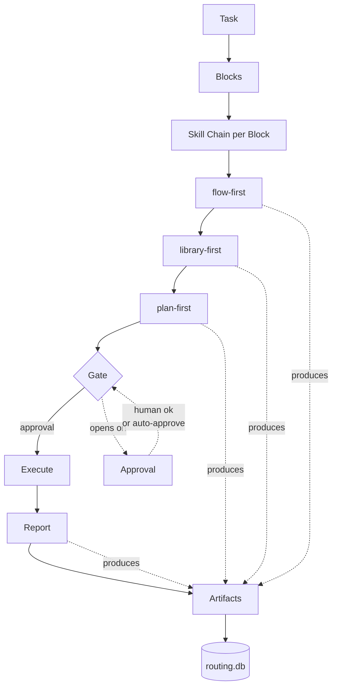

# The Framework

An artifact-first agent framework for driving multi-step engineering tasks
through a disciplined skill chain — one block at a time, one commit at a
time, every decision written down.

## What this is

Every task in the framework is decomposed into small blocks. Each block
runs a fixed chain of skills — `flow-first` aligns understanding,
`library-first` picks reuse over rewrites, `plan-first` shows the plan
before touching code, `ship-first` closes with a report. Each skill
produces a tracked artifact in a routing database; nothing that happened
lives only in chat.

## Why it exists

Chat is not storage. Ad-hoc AI-driven work drifts because there is no
record of what the agent understood, what it decided, and why. This
framework fixes that by making every step produce a first-class file: a
plan, a decision doc, a report. Reviewers can audit any block by opening
one folder. Progress is measurable. Regressions are attributable.

## How to try it

Install once, initialize once, run your first task. The framework ships
as plain markdown skill files plus small bash tooling — no runtime, no
service, no vendor lock-in. Any agent that can invoke skills by name can
use it; the shipped skills are designed for Claude but the artifact
contract is language-agnostic.

## One-page flow



Each block moves left-to-right through the chain. Every node marked
"produces" writes an artifact to `routing.db`. The Gate stops the chain
until an Approval opens it — from a human or from an orchestrator skill
that validated the previous artifact against a checklist.

## Install

```bash
git clone <this-repo> framework
cd framework
./bin/init                    # interactive wizard writes framework.yml
$EDITOR framework.yml         # optional — add your projects list
./bin/sync-from-aihub.sh      # optional — syncs skill updates from source
```

That's five commands. `bin/init` prompts you for 7 path / host values
with sensible defaults; empty input keeps the default.

## First run

Once `framework.yml` exists, any agent that supports `Skill('name')`
invocation can run `/go-fast "your first task"`. Follow the chain
prompts — flow-first will ask for anchors, library-first will show the
LOC table, plan-first will show the plan before writing anything.

## Requirements

- **bash 3.2+** (macOS default) or newer
- **python3** (any recent 3.x) — used for YAML parsing in `bin/*.sh`
- **sqlite3** — for the routing database
- **git** — for artifact history

No other runtime dependencies. No services. No package installers.

## Documentation

- [`docs/CONCEPTS.md`](./docs/CONCEPTS.md) — glossary of the seven core
  terms (artifact / task / block / skill / chain / gate / approval).
  Read this first.
- [`docs/SKILLS_MAP.md`](./docs/SKILLS_MAP.md) — at-a-glance table of
  every shipped skill: tier, role, what it invokes, what it delivers.
- [`docs/SKILL_CONTRACT.md`](./docs/SKILL_CONTRACT.md) — the authoring
  standard for skill files. Required reading if you plan to add or
  modify a skill.

## Tooling

- `bin/init` — interactive setup wizard (first-run).
- `bin/sync-from-aihub.sh` — pulls skill updates from an upstream source
  repository (optional; useful for tracking framework evolution).
- `bin/gen-skills-map.sh` — regenerates `docs/SKILLS_MAP.md` from the
  current manifest and skill files.
- `bin/verify-contract.sh` — lints every skill against
  `docs/SKILL_CONTRACT.md`.

## License

Released under the MIT License — see [LICENSE](./LICENSE).

## Status

MVP. The 13 shipped skills are functional and used daily; the surrounding
tooling (contract verifier, skills map generator, init wizard) is
scaffolding for the public release. See individual skill files for
maturity notes.
