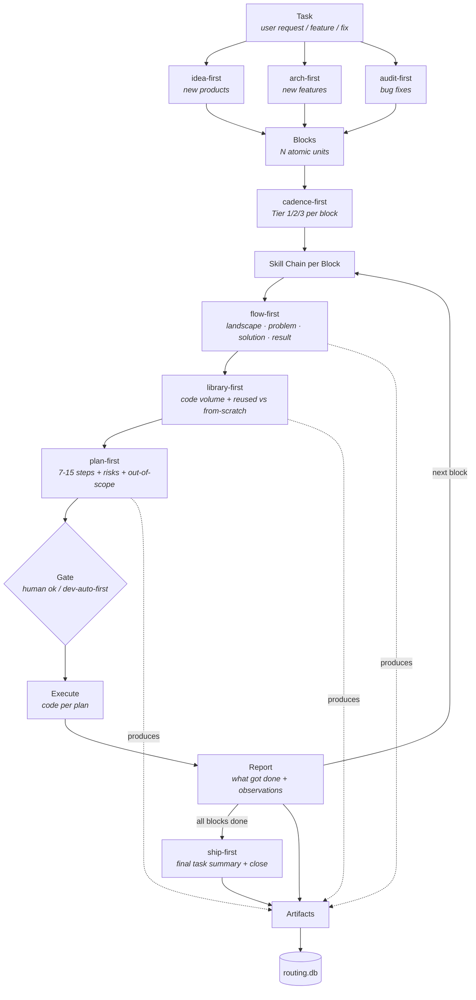

[English](./README.md) · [Русский](./README.ru.md)

[](https://opensource.org/licenses/MIT)
[](./manifest.yml)
[](./docs/SKILLS_MAP.md)
[](https://github.com/bearded-illirian/trailmark/stargazers)
[](https://github.com/bearded-illirian/trailmark/issues)

# Trailmark

**An artifact-first agent framework for driving multi-step engineering tasks
through a disciplined skill chain — one block at a time, one commit at a
time, every decision written down.**

Every step your AI agent takes writes a file. Every file registers in a local
database. Every **block** *(one unit of work inside a task)* closes with a
**report** *(the markdown summary written after execution)*. Nothing lives
only in chat.


**Find any artifact — decision, plan, report, note — in 3-4 clicks.**


<p align="center"><em>No more "hey Claude, remind me what we did in that task last week." Open Flow UI, click the task, see every file the block produced. Reviewable, searchable, permanent.</em></p>

---

## What Trailmark solves

Three pains every Claude Code developer hits — and how Trailmark structurally prevents each.

### 1. Session amnesia — "what did we decide yesterday?"

Chat sessions are ephemeral. Every new window = context reset. Two weeks later you can't recall why you chose approach X over Y, or what alternatives you considered.

**Trailmark's answer:** every decision writes a file — `flow-first-N.md` (landscape), `library-first-N.md` (LOC + reused vs from-scratch), `plan-first-N.md` (7-15 step plan), `report-N.md` (what got done + observations), `decision-N.md` (any non-trivial choice with alternatives). Grep the archive in seconds. **Don't remember — read.**

### 2. Unpredictable output quality — "lucky or not"

You ask the AI "build X" and hope. Sometimes gold, sometimes shallow. No repeatable pre-work — the agent decides its own approach every time.

**Trailmark's answer:** enforced skill chain. Every block **must** pass through `flow-first` (understanding table) → `library-first` (LOC estimate) → `plan-first` (7-15 steps) **before touching code**. If the agent tried to skip — the block isn't closed. **Predictable quality per block, every time.**

### 3. Regression archaeology — "broke, but when and why?"

Something worked last week, fails today. Git blame shows "fix bug" without context. Which decision led here?

**Trailmark's answer:** every artifact registers in `routing.db` with timestamp, block_num, task_id. On regression: `SELECT` blocks that touched the file → read `plan-first-N.md` for rationale → `git blame` for commit hash. **Regression → block → decision → source code in 30 seconds.**

### 4. Cost bleed — "AI costs as much as the developer"

Agent-heavy frameworks spawn 5-10 validator subagents per task. Each subagent reloads full context (30-40k tokens per invocation), runs its check, returns a summary. Multiply by 3 fix iterations — one micro-feature burns hundreds of thousands of tokens before any code is written. **On a Claude subscription that eats your weekly rate limits fast. Paying per token, that costs $10-20 per micro-feature.**

**Trailmark's answer:** all skills run in your main Claude context — no fresh-context subagent bloat. `cadence-first` assigns Tier 1/2/3 per block: trivial fixes run Plan-only (~$0.15 or minimal tokens), complex refactors run the full chain (~$1-2 or ~50k tokens). **5-10x less token consumption than agent-heavy frameworks — no burning through rate limits, no $60/micro-feature bills.**

**Result:** your AI-driven engineering becomes stable and predictable — every decision auditable, every regression traceable, every session continues where the last one left off, and you don't hit rate limits or burn $60 on a micro-feature.

---

## Why artifact-first

**Without artifact-first:**

- Decisions evaporate the moment the session ends
- Reviewers can't audit what was considered and rejected
- Regressions can't be traced to a specific change
- Next session starts from zero — no cross-block memory

**With artifact-first — this framework's rule:**

- Each **skill** *(a reusable protocol like `flow-first` or `plan-first`)* must produce a first-class file (landscape table, LOC estimate, decision doc, report)
- Every file registers in `routing.db`
- If a step didn't produce an artifact — **it didn't happen**

Chat log → auditable engineering record. **One rule, enforced by protocol.**

### Skills-first, not agent-heavy

Trailmark ships 19 skills that run in **your main Claude context** — not as isolated subagents that reload 30-40k tokens each invocation. This is a deliberate design choice, not a missing feature:

- **Cost per task drops 5-10x** — no subagent bloat on trivial work (Tier 3 block ≈ $0.15)
- **Everything is debuggable** — all tool calls, all edits, all validation checks visible in the chat
- **Simpler onboarding** — one abstraction to learn (skills), not two (skills + agents)
- **Right-sized cadence** — `cadence-first` picks Tier 1/2/3 per block instead of running one heavy pipeline for everything

Targeted agents (research, parallel audit, security scan) will be added as **opt-in power tools** in later releases — for the 10% of work where genuine parallelism or context isolation wins. Not as mandatory overhead on every task.

**See where AI time actually goes — no manual audit needed.**


<p align="center"><em>Which projects dominate. Which task types are common. Which artifact types get produced. Real numbers from real work, not your gut feeling of "we probably refactored a lot."</em></p>

---

## How this compares

| Axis | Prescriptive documentation-first frameworks | Executable orchestrators (LangChain, CrewAI) | Editor-embedded rules (e.g. Cursor rules) | **This framework** |
|---|---|---|---|---|
| **Ships** | Documentation (roles, rules, checklists) you apply by hand | Python runtime + agent graph you code against | System prompts + rule files | Skills + tooling + artifact registry |
| **Artifacts as first-class** | ❌ Prose only | ⚠️ Optional / ad-hoc traces | ❌ Ephemeral chat | ✅ Every step writes a tracked file |
| **Cross-block memory** | ❌ Human's responsibility | ⚠️ Depends on your setup | ❌ Per-session | ✅ Registry survives sessions |
| **Approval gates** | ❌ Etiquette / prose rules | ⚠️ Callback hooks you wire | ❌ Trust the model | ✅ Enforced by protocol skills |
| **Onboarding** | Hours reading docs → apply | Learn API + build workflow | Copy rules → hope | `git clone → bin/init → bin/new-project → bin/flow-ui/bin/serve` |
| **Lock-in** | Just documentation (no runtime) | Runtime + vendor SDK | Editor-specific | Plain markdown + bash + sqlite |
| **Language of skills** | Domain jargon | Python | Model prompts | Plain markdown, editable |
| **Architecture** | Prose only | Runtime + agent graph | Rule files in editor | Skills-first in main context, agents on demand (post-launch) |
| **Cost per typical task** | N/A (human labor) | Medium (custom code, varies) | Low (single-turn prompts) | **Low — $0.15-2/block** |

Different tools for different problems. If you're formalising a large team's
process, prescriptive frameworks fit. If you're building autonomous agents at
scale, LangChain / CrewAI fit. This framework fits when you want **discipline
without a runtime** — every step of every task auditable, but nothing to
maintain beyond files.

_Note: this framework runs on top of an agent runtime that can discover
skills and invoke them by name — Claude Code today, with an experimental
Codex adapter in `adapters/codex/`. The comparison above is against
categories of methodology, not against the underlying agent harness: the
runtime is what we build on, not a competitor._

For detailed side-by-side comparisons vs specific frameworks (BMAD-Method,
Superpowers, and others) → see [docs/COMPARISON.md](docs/COMPARISON.md).

If you already use ADR files, Obsidian, `git log`, or other single-purpose
tools for parts of what Trailmark does → see [docs/ALTERNATIVES.md](docs/ALTERNATIVES.md)
for how the registry differs from tool-level solutions.

---

## Who this is for

| For whom | Not the best fit |
|---|---|
| Solo or small-team engineers using Claude Code (or any agent that supports named skills) | Enterprise teams with a dedicated process organisation — a prescriptive framework will match your language better |
| People who want an **audit trail** across many blocks, weeks, and sessions | People who want a **hosted runtime** and prebuilt agent graphs — LangChain / CrewAI fit better |
| People who prefer plain markdown + bash + git over new SDKs | People who need Windows-first bash tooling out of the box (Unix-first here) |
| **Devs who value engineering efficiency** — whether hitting rate limits on a Claude subscription or paying per token | Devs shipping small features where efficiency doesn't matter, or those with unlimited API token budgets |

If you're one person or a small team shipping engineering work with an agent —
and you care about **an audit trail across sessions**, **engineering efficiency**
(5-10x less token consumption vs agent-heavy frameworks — no burning through plan
rate limits or per-token budgets), and **debuggable workflow** (skills in your
main context, not black-box subagents) — you're in the target audience.

---

## Architecture

Once initialised, your workspace looks like:

```
workspace-root/
├── aihub/               # Central skill registry — one source, many consumers
│   └── .claude/
│       ├── skills/      # 17 skills (protocol + core)
│       └── commands/    # 2 slash-commands (/go-start, /go-fast)
├── projects/            # Your projects — each symlinks aihub skills
│   ├── my-app/.claude/skills → ../../aihub/.claude/skills
│   └── another/.claude/skills → ../../aihub/.claude/skills
├── tasks/               # Unified task tracking across all projects
│   ├── routing.db       # SQLite — task_artifacts, blocks, deploys
│   └── log/             # Per-task folders with all artifacts
├── bin/                 # Workspace tooling
│   ├── init             # First-run wizard
│   ├── new-project      # Register a new project
│   ├── sync-from-aihub.sh    # Pull skill updates from upstream
│   └── flow-ui/         # Local web browser over routing.db
├── docs/                # Framework documentation
└── manifest.yml         # Declares what ships (20 entries: 2 cmd + 4 protocol + 13 core + 1 tool)
```

**Hub-and-spoke skills.** All projects share the same `aihub/.claude/skills/`
via symlink — edit a skill once, every project sees the change on the next
invocation. No per-project duplication, no drift.

**Unified task tracking.** Tasks from every project write to the same
`routing.db`. Cross-project queries ("what did we touch this week?") work
natively.

**Something broke after deploy? Find the cause in 2 clicks — no digging through commit history.**


<p align="center"><em>In Flow UI you click the deploy — the right panel opens the note from that block: what was changed, why that decision was made, what to check first if something breaks. No manual diffing between commit states, no asking the AI "what were we doing back then?"</em></p>

---

## One-page flow



A Task first goes through a **decomposition skill** — `arch-first` for
features, `audit-first` for fixes, `idea-first` for new products — which
carves it into N pre-planned Blocks. `cadence-first` then assigns each
block a Tier (1/2/3) to right-size the skill chain.

Per block: the chain runs left-to-right — `flow-first` → `library-first`
→ `plan-first`. The **Gate** stops execution until it's opened, either
by a human `ok` or by `dev-auto-first` which validates the previous
artifact against a checklist and auto-approves.

After Execute + Report, the loop returns to the next block. When all
blocks are done, `ship-first` writes the final task summary and closes
the task. Every artifact — from decomposition through ship-first — lands
in `routing.db`.

---

## Flow UI

`bin/flow-ui/` is a local web browser over `routing.db` + `task_artifacts` +
your project filesystems. Runs on `127.0.0.1:8765`, read-only against the
database, no auth, no cloud.

```bash
bash bin/flow-ui/bin/serve    # start (idempotent, backgrounded)
bash bin/flow-ui/bin/status   # check
bash bin/flow-ui/bin/stop     # stop
```

Then open `http://127.0.0.1:8765/`. You see: projects, tasks per project,
blocks per task, artifacts per block, deploys, and skill-usage analytics.
No YAML editing. No CLI queries. Point and read.

**Which skills fire most, which are dead weight — see it before deciding to add more.**


<p align="center"><em>Not "we probably need one more skill for X" — actual usage counts. Ship-first tops the chart because every block ends with it. Dormant skills are curation candidates. Domain coverage shows where work runs on protocols vs where it's still ad-hoc.</em></p>

---

## Install

```bash
git clone <this-repo> framework
cd framework
bash bin/init                        # 3-question wizard writes framework.yml
bash bin/init-demo                   # recommended: seed 3 projects × 2 tasks populated tour
bash bin/new-project my-first-app    # register your own project
```

Three commands, ~1 minute. `bin/init` prompts you for 3 values: aihub location
(default: bundled `./aihub`), optional deploy server, optional Telegram relay.
Empty input keeps the default.

`bin/init-demo` populates the workspace with **3 demo projects × 2 tasks ×
5 artifacts each** (123 rows + 6 folders) so Flow UI shows realistic content
on first serve. Every row is marked `is_demo=1` and tracked in
`tasks/.demo-manifest.json`. Remove cleanly later with `bash bin/archive-demo`
(3-marker safety — your real data is never touched). See
[`docs/DEMO_DATA.md`](./docs/DEMO_DATA.md) for the full guarantee.

`bin/new-project <id>` creates `projects/<id>/.claude/skills` as a symlink
to `aihub/.claude/skills` and appends an entry to `aihub/projects.yml`.

---

## First run

```bash
cd projects/my-first-app
claude                               # or any runtime that invokes skills by name
/go-start
/go-fast "add a hello function to greetings.py"
```

Follow the chain — `flow-first` will ask for anchors, `library-first` will
show a LOC table with what's reused vs new, `plan-first` will show the plan
before touching code. Approve each gate (`ok` at flow-first, `ok` at
library-first, `1` at plan-first for autopilot). The agent executes. Every
artifact lands in `tasks/log/<slug>/`.

Open `http://127.0.0.1:8765/` in another terminal window to watch artifacts
appear as the block runs.

### Verify with /tutorial-check

After completing your first real task, run:

```
/tutorial-check
```

The shipped `tutorial-check` skill validates your setup via 5-6 SQL and
file checks — reports ✅/❌ per step so you know exactly what landed
correctly and what needs attention. Full homework walkthrough:
[`docs/QUICKSTART.md`](./docs/QUICKSTART.md) § 5.

---

## Documentation

- [`docs/CONCEPTS.md`](./docs/CONCEPTS.md) — glossary of core terms
  (artifact / task / block / skill / chain / gate / approval). Read this first.
- [`docs/SKILLS_MAP.md`](./docs/SKILLS_MAP.md) — every shipped skill: tier,
  role, what it invokes, what it delivers.
- [`docs/SKILL_CONTRACT.md`](./docs/SKILL_CONTRACT.md) — authoring standard
  for skill files. Required reading if you plan to add or modify a skill.
- [`docs/PROJECTS_GUIDE.md`](./docs/PROJECTS_GUIDE.md) — the hub-and-spoke
  project pattern in detail (includes Advanced: project-local skill overrides).
- [`docs/QUICKSTART.md`](./docs/QUICKSTART.md) — 5-step walkthrough with homework.
- [`docs/DEMO_DATA.md`](./docs/DEMO_DATA.md) — demo dataset guide (init-demo,
  archive-demo, 3-marker safety guarantees).
- [`docs/TROUBLESHOOTING.md`](./docs/TROUBLESHOOTING.md) — top failure modes and fixes.
- [`docs/AUTO_DEPLOY_RECIPE.md`](./docs/AUTO_DEPLOY_RECIPE.md) — opt-in
  git-push auto-deploy pattern (bare repo + post-receive + snapshot backups).
- [`CONTRIBUTING.md`](./CONTRIBUTING.md) — how to add / modify skills,
  contract compliance, PR flow.
- [`CHANGELOG.md`](./CHANGELOG.md) — semver release history.
- [`FAQ.md`](./FAQ.md) — 10 common questions with honest answers.
- [`SECURITY.md`](./SECURITY.md) — vulnerability disclosure policy.
- [`CODE_OF_CONDUCT.md`](./CODE_OF_CONDUCT.md) — Contributor Covenant v2.1.
- [`docs/ANTI_PATTERNS.md`](./docs/ANTI_PATTERNS.md) — what artifact-first structurally prevents.

---

## Requirements

- **bash 3.2+** (macOS default) or newer
- **python3** (any recent 3.x) — used for YAML parsing in `bin/*.sh`
- **sqlite3** — for the routing database
- **git** — for artifact history

Flow UI additionally needs Python packages: `fastapi`, `uvicorn`, `pyyaml`,
`jinja2` (installed via `pip install -r bin/flow-ui/requirements.txt`).

No services. No package managers beyond pip for Flow UI.

---

## Tooling

- `bin/init` — first-run wizard.
- `bin/new-project <id>` — register a new project (symlink + registry entry).
- `bin/sync-from-aihub.sh` — pull skill updates from an upstream aihub source.
- `bin/gen-skills-map.sh` — regenerate `docs/SKILLS_MAP.md` from the manifest.
- `bin/verify-contract.sh` — lint every skill against `docs/SKILL_CONTRACT.md`.
- `bin/flow-ui/bin/serve|status|stop` — local web browser.

---

## Status

**Current release — 19 skills + 1 tool, manifest v1.0.0.**

The 19 shipped skills (2 slash-commands + 4 protocol skills + 13 core skills)
are functional and used daily on real production work. The Flow UI is a
sibling tool synced from an upstream repo via the `tool` tier. Surrounding
tooling (contract verifier, skills map generator, init wizard, sync script,
Discussions/Issue templates) is stable for the public release.

**Not a demo — this is the author's real production instance.**


<p align="center"><em>3 months of daily use → 18k artifacts, 1276 tasks, 5.5k deploys, 6 domains, 72 skills active. Trailmark runs daily engineering on real projects. Every design decision baked in survived stress-testing at this scale.</em></p>

CI workflow verifies contracts on every push. First stable release v1.0.0
tagged — see [Releases](../../releases/tag/v1.0.0).

### Coming from Codex / Cursor / another agent?

Trailmark currently runs on Claude Code only. An **experimental** Codex adapter
lives in [`adapters/codex/`](./adapters/codex/) — generated and reviewed, never
yet run on a live install; its README says what is verified and what is not.

If you'd use Trailmark on another agent, drop a comment on
[Discussion #1](https://github.com/bearded-illirian/trailmark/discussions/1)
with which platform you're on. **If we hit 10+ signals, I'll prioritise
the port.**

---

## License

Released under the MIT License — see [LICENSE](./LICENSE).

Public mirror: [github.com/bearded-illirian/trailmark](https://github.com/bearded-illirian/trailmark)
