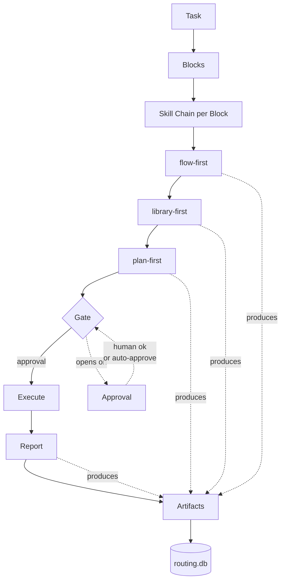

[English](./README.md) · [Русский](./README.ru.md)

[](https://opensource.org/licenses/MIT)
[](./manifest.yml)
[](./docs/SKILLS_MAP.md)
[](https://github.com/bearded-illirian/trailmark/stargazers)
[](https://github.com/bearded-illirian/trailmark/issues)

# Trailmark

**An artifact-first agent framework for driving multi-step engineering tasks
through a disciplined skill chain — one block at a time, one commit at a
time, every decision written down.**

Every step your AI agent takes writes a file. Every file registers in a local
database. Every **block** *(one unit of work inside a task)* closes with a
**report** *(the markdown summary written after execution)*. Nothing lives
only in chat.


---

## Why artifact-first

**Without artifact-first:**

- Decisions evaporate the moment the session ends
- Reviewers can't audit what was considered and rejected
- Regressions can't be traced to a specific change
- Next session starts from zero — no cross-block memory

**With artifact-first — this framework's rule:**

- Each **skill** *(a reusable protocol like `flow-first` or `plan-first`)* must produce a first-class file (landscape table, LOC estimate, decision doc, report)
- Every file registers in `routing.db`
- If a step didn't produce an artifact — **it didn't happen**

Chat log → auditable engineering record. **One rule, enforced by protocol.**

---

## How this compares

| Axis | Prescriptive documentation-first frameworks | Executable orchestrators (LangChain, CrewAI) | Editor-embedded rules (e.g. Cursor rules) | **This framework** |
|---|---|---|---|---|
| **Ships** | Documentation (roles, rules, checklists) you apply by hand | Python runtime + agent graph you code against | System prompts + rule files | Skills + tooling + artifact registry |
| **Artifacts as first-class** | ❌ Prose only | ⚠️ Optional / ad-hoc traces | ❌ Ephemeral chat | ✅ Every step writes a tracked file |
| **Cross-block memory** | ❌ Human's responsibility | ⚠️ Depends on your setup | ❌ Per-session | ✅ Registry survives sessions |
| **Approval gates** | ❌ Etiquette / prose rules | ⚠️ Callback hooks you wire | ❌ Trust the model | ✅ Enforced by protocol skills |
| **Onboarding** | Hours reading docs → apply | Learn API + build workflow | Copy rules → hope | `git clone → bin/init → bin/new-project → bin/flow-ui/bin/serve` |
| **Lock-in** | Zero — it's a book | Runtime + vendor SDK | Editor-specific | Plain markdown + bash + sqlite |
| **Language of skills** | Domain jargon | Python | Model prompts | Plain markdown, editable |

Different tools for different problems. If you're formalising a large team's
process, prescriptive frameworks fit. If you're building autonomous agents at
scale, LangChain / CrewAI fit. This framework fits when you want **discipline
without a runtime** — every step of every task auditable, but nothing to
maintain beyond files.

_Note: this framework runs on top of Claude Code (or any agent supporting
`Skill('name')` invocation). The comparison above is against categories of
methodology, not against the underlying agent harness — Claude Code is the
runtime we build on, not a competitor._

---

## Who this is for

| For whom | Not the best fit |
|---|---|
| Solo or small-team engineers using Claude Code (or any agent that supports named skills) | Enterprise teams with a dedicated process organisation — a prescriptive framework will match your language better |
| People who want an **audit trail** across many blocks, weeks, and sessions | People who want a **hosted runtime** and prebuilt agent graphs — LangChain / CrewAI fit better |
| People who prefer plain markdown + bash + git over new SDKs | People who need Windows-first bash tooling out of the box (Unix-first here) |

If you're one person or a small team shipping engineering work with an agent,
and you keep wishing "there was a record of why we did this" — you're in the
target audience.

---

## Architecture

Once initialised, your workspace looks like:

```
workspace-root/
├── aihub/               # Central skill registry — one source, many consumers
│   └── .claude/
│       ├── skills/      # 17 skills (protocol + core)
│       └── commands/    # 2 slash-commands (/go-start, /go-fast)
├── projects/            # Your projects — each symlinks aihub skills
│   ├── my-app/.claude/skills → ../../aihub/.claude/skills
│   └── another/.claude/skills → ../../aihub/.claude/skills
├── tasks/               # Unified task tracking across all projects
│   ├── routing.db       # SQLite — task_artifacts, blocks, deploys
│   └── log/             # Per-task folders with all artifacts
├── bin/                 # Workspace tooling
│   ├── init             # First-run wizard
│   ├── new-project      # Register a new project
│   ├── sync-from-aihub.sh    # Pull skill updates from upstream
│   └── flow-ui/         # Local web browser over routing.db
├── docs/                # Framework documentation
└── manifest.yml         # Declares what ships (20 entries: 2 cmd + 4 protocol + 13 core + 1 tool)
```

**Hub-and-spoke skills.** All projects share the same `aihub/.claude/skills/`
via symlink — edit a skill once, every project sees the change on the next
invocation. No per-project duplication, no drift.

**Unified task tracking.** Tasks from every project write to the same
`routing.db`. Cross-project queries ("what did we touch this week?") work
natively.

---

## One-page flow



Each block moves left-to-right through the **chain** *(fixed sequence of
skills per block)*. Every node marked "produces" writes an artifact to
`routing.db`. The **Gate** *(approval checkpoint before execution)* stops
the chain until an Approval opens it — from a human, or from `dev-auto-first`
which validates the previous artifact against a checklist and auto-approves.

---

## Flow UI

`bin/flow-ui/` is a local web browser over `routing.db` + `task_artifacts` +
your project filesystems. Runs on `127.0.0.1:8765`, read-only against the
database, no auth, no cloud.

```bash
bash bin/flow-ui/bin/serve    # start (idempotent, backgrounded)
bash bin/flow-ui/bin/status   # check
bash bin/flow-ui/bin/stop     # stop
```

Then open `http://127.0.0.1:8765/`. You see: projects, tasks per project,
blocks per task, artifacts per block, deploys, and skill-usage analytics.
No YAML editing. No CLI queries. Point and read.

<!-- TODO: swap TBD for the real Loom share URL after recording block 50.
     Optional: uncomment the gif preview once docs/assets/loom-preview.gif is uploaded. -->
▶️ **[Watch the 90-sec demo on Loom](https://www.loom.com/share/TBD)**

<!--  -->

---

## Install

```bash
git clone <this-repo> framework
cd framework
bash bin/init                        # 3-question wizard writes framework.yml
bash bin/init-demo                   # recommended: seed 3 projects × 2 tasks populated tour
bash bin/new-project my-first-app    # register your own project
```

Three commands, ~1 minute. `bin/init` prompts you for 3 values: aihub location
(default: bundled `./aihub`), optional deploy server, optional Telegram relay.
Empty input keeps the default.

`bin/init-demo` populates the workspace with **3 demo projects × 2 tasks ×
5 artifacts each** (123 rows + 6 folders) so Flow UI shows realistic content
on first serve. Every row is marked `is_demo=1` and tracked in
`tasks/.demo-manifest.json`. Remove cleanly later with `bash bin/archive-demo`
(3-marker safety — your real data is never touched). See
[`docs/DEMO_DATA.md`](./docs/DEMO_DATA.md) for the full guarantee.

`bin/new-project <id>` creates `projects/<id>/.claude/skills` as a symlink
to `aihub/.claude/skills` and appends an entry to `aihub/projects.yml`.

---

## First run

```bash
cd projects/my-first-app
claude                               # or any agent supporting Skill('name')
/go-start
/go-fast "add a hello function to greetings.py"
```

Follow the chain — `flow-first` will ask for anchors, `library-first` will
show a LOC table with what's reused vs new, `plan-first` will show the plan
before touching code. Approve each gate (`ok` at flow-first, `ok` at
library-first, `1` at plan-first for autopilot). The agent executes. Every
artifact lands in `tasks/log/<slug>/`.

Open `http://127.0.0.1:8765/` in another terminal window to watch artifacts
appear as the block runs.

### Verify with /tutorial-check

After completing your first real task, run:

```
/tutorial-check
```

The shipped `tutorial-check` skill validates your setup via 5-6 SQL and
file checks — reports ✅/❌ per step so you know exactly what landed
correctly and what needs attention. Full homework walkthrough:
[`docs/QUICKSTART.md`](./docs/QUICKSTART.md) § 5.

---

## Documentation

- [`docs/CONCEPTS.md`](./docs/CONCEPTS.md) — glossary of core terms
  (artifact / task / block / skill / chain / gate / approval). Read this first.
- [`docs/SKILLS_MAP.md`](./docs/SKILLS_MAP.md) — every shipped skill: tier,
  role, what it invokes, what it delivers.
- [`docs/SKILL_CONTRACT.md`](./docs/SKILL_CONTRACT.md) — authoring standard
  for skill files. Required reading if you plan to add or modify a skill.
- [`docs/PROJECTS_GUIDE.md`](./docs/PROJECTS_GUIDE.md) — the hub-and-spoke
  project pattern in detail (includes Advanced: project-local skill overrides).
- [`docs/QUICKSTART.md`](./docs/QUICKSTART.md) — 5-step walkthrough with homework.
- [`docs/DEMO_DATA.md`](./docs/DEMO_DATA.md) — demo dataset guide (init-demo,
  archive-demo, 3-marker safety guarantees).
- [`docs/TROUBLESHOOTING.md`](./docs/TROUBLESHOOTING.md) — top failure modes and fixes.
- [`docs/AUTO_DEPLOY_RECIPE.md`](./docs/AUTO_DEPLOY_RECIPE.md) — opt-in
  git-push auto-deploy pattern (bare repo + post-receive + snapshot backups).
- [`CONTRIBUTING.md`](./CONTRIBUTING.md) — how to add / modify skills,
  contract compliance, PR flow.
- [`CHANGELOG.md`](./CHANGELOG.md) — semver release history.
- [`FAQ.md`](./FAQ.md) — 10 common questions with honest answers.
- [`SECURITY.md`](./SECURITY.md) — vulnerability disclosure policy.
- [`CODE_OF_CONDUCT.md`](./CODE_OF_CONDUCT.md) — Contributor Covenant v2.1.
- [`docs/ANTI_PATTERNS.md`](./docs/ANTI_PATTERNS.md) — what artifact-first structurally prevents.

---

## Requirements

- **bash 3.2+** (macOS default) or newer
- **python3** (any recent 3.x) — used for YAML parsing in `bin/*.sh`
- **sqlite3** — for the routing database
- **git** — for artifact history

Flow UI additionally needs Python packages: `fastapi`, `uvicorn`, `pyyaml`,
`jinja2` (installed via `pip install -r bin/flow-ui/requirements.txt`).

No services. No package managers beyond pip for Flow UI.

---

## Tooling

- `bin/init` — first-run wizard.
- `bin/new-project <id>` — register a new project (symlink + registry entry).
- `bin/sync-from-aihub.sh` — pull skill updates from an upstream aihub source.
- `bin/gen-skills-map.sh` — regenerate `docs/SKILLS_MAP.md` from the manifest.
- `bin/verify-contract.sh` — lint every skill against `docs/SKILL_CONTRACT.md`.
- `bin/flow-ui/bin/serve|status|stop` — local web browser.

---

## Status

**Current release — 19 skills + 1 tool, manifest v0.8.0.**

The 19 shipped skills (2 slash-commands + 4 protocol skills + 13 core skills)
are functional and used daily on real production work. The Flow UI is a
sibling tool synced from an upstream repo via the `tool` tier. Surrounding
tooling (contract verifier, skills map generator, init wizard, sync script,
Discussions/Issue templates) is stable for the public release.

A CI workflow (`.github/workflows/verify-contract.yml`) and full v1.0.0-mvp
tag are the last steps of the release roadmap.

---

## Star history

[](https://star-history.com/#bearded-illirian/trailmark&Date)

---

## License

Released under the MIT License — see [LICENSE](./LICENSE).

Public mirror: [github.com/bearded-illirian/trailmark](https://github.com/bearded-illirian/trailmark)
