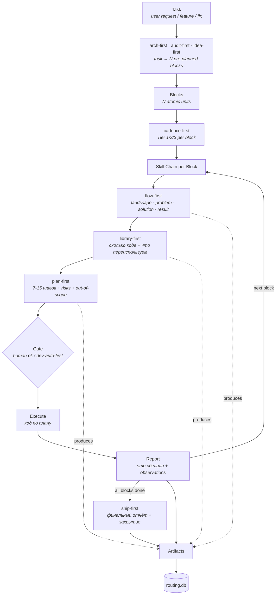

[English](./README.md) · [Русский](./README.ru.md)

[](https://opensource.org/licenses/MIT)
[](./manifest.yml)
[](./docs/SKILLS_MAP.md)
[](https://github.com/bearded-illirian/trailmark/stargazers)
[](https://github.com/bearded-illirian/trailmark/issues)

# Trailmark

**Artifact-first agent-фреймворк для многоэтапных инженерных задач через
дисциплинированную цепочку скиллов — один блок за раз, один коммит за раз,
каждое решение зафиксировано в файле.**

Каждый шаг AI-агента пишет файл. Каждый файл регистрируется в локальной
базе. Каждый **блок** *(единица работы внутри задачи)* закрывается
**отчётом** *(markdown-сводка после выполнения)*. Ничего не живёт только
в чате.


---

## Какие проблемы решает Trailmark

Три боли каждого разработчика на Claude Code — и как Trailmark structurally предотвращает каждую.

### 1. Session amnesia — «а что мы вчера решали?»

Chat-сессии эфемерны. Каждое новое окно = context reset. Через две недели ты не помнишь почему выбрал подход X, какие альтернативы рассматривал, что вчерашний агент сделал и зачем.

**Ответ Trailmark:** каждое решение пишет файл — `flow-first-N.md` (landscape), `library-first-N.md` (LOC + reused vs from-scratch), `plan-first-N.md` (7-15 шагов плана), `report-N.md` (что сделано + observations), `decision-N.md` (любой non-trivial выбор с alternatives). Грепаешь архив за секунды. **Не нужно помнить — читаешь.**

### 2. Unpredictable output quality — «повезло или нет»

Бросаешь агенту «сделай X» и надеешься. Иногда gold, иногда халтура. Нет обязательного pre-work — агент каждый раз сам решает как подойти.

**Ответ Trailmark:** enforced skill chain. Каждый блок **обязан** пройти `flow-first` (understanding table) → `library-first` (LOC estimate) → `plan-first` (7-15 шагов) **до касания кода**. Если агент попытался пропустить — блок не считается закрытым. **Predictable quality per block, каждый раз.**

### 3. Regression archaeology — «сломалось, но когда и почему?»

Что-то работало неделю назад, сегодня падает. Git blame показывает «fix bug» без контекста. Какое решение AI привело к regression?

**Ответ Trailmark:** каждый артефакт регистрируется в `routing.db` с timestamp, block_num, task_id. При regression: `SELECT` блоков, которые касались файла → читаешь `plan-first-N.md` для контекста → `git blame` показывает commit hash. **Regression → block → decision → source code за 30 секунд.**

**Результат:** работа с AI становится стабильной и предсказуемой — каждое решение аудируемо, каждая регрессия трассируется, каждая сессия продолжается с того места, где закончилась предыдущая.

---

## Почему artifact-first

**Без artifact-first:**

- Решения испаряются в момент закрытия сессии
- Ревьюер не может проверить, что было рассмотрено vs отклонено
- Регрессии не отслеживаются до конкретного изменения
- Следующая сессия начинается с нуля — без cross-block памяти

**С artifact-first — правило этого фреймворка:**

- Каждый **скилл** *(переиспользуемый протокол типа `flow-first` или `plan-first`)* обязан создать first-class файл (landscape-таблицу, LOC-оценку, decision-документ, отчёт)
- Каждый файл регистрируется в `routing.db`
- Если шаг не создал артефакт — **шага не было**

Чат-лог → аудируемая инженерная запись. **Одно правило, enforced by protocol.**

---

## Как мы сравниваемся

| Ось | Прескриптивные documentation-first фреймворки | Executable-оркестраторы (LangChain, CrewAI) | Editor-embedded rules (напр. Cursor rules) | **Этот фреймворк** |
|---|---|---|---|---|
| **Что поставляется** | Документация (роли, правила, чек-листы), применяешь руками | Python-рантайм + граф агентов, кодишь на нём | Системные промпты + rule-файлы | Скиллы + tooling + реестр артефактов |
| **Артефакты как first-class** | ❌ Только проза | ⚠️ Опционально / ad-hoc trace | ❌ Эфемерный чат | ✅ Каждый шаг пишет tracked-файл |
| **Cross-block память** | ❌ На человеке | ⚠️ Зависит от вашей обвязки | ❌ Per-session | ✅ Реестр переживает сессии |
| **Approval gates** | ❌ Этикет / prose-правила | ⚠️ Callback-хуки, которые вы вешаете | ❌ Доверие модели | ✅ Enforced протокольными скиллами |
| **Онбординг** | Часы чтения доков → применение | Изучение API + сборка workflow | Копирование rules → надежда | `git clone → bin/init → bin/new-project → bin/flow-ui/bin/serve` |
| **Lock-in** | Ноль — это книга | Рантайм + vendor SDK | Editor-specific | Plain markdown + bash + sqlite |
| **Язык скиллов** | Domain-жаргон | Python | Промпты модели | Обычный markdown, редактируется |

Разные инструменты для разных задач. Если формализуете процесс большой
команды — подходит прескриптивный фреймворк. Если строите автономных
агентов at scale — подходит LangChain / CrewAI. Этот фреймворк подходит
когда нужна **дисциплина без рантайма** — каждый шаг каждой задачи
аудируем, но поддерживать нечего кроме файлов.

_Note: этот фреймворк работает поверх Claude Code (или любого агента с
поддержкой `Skill('name')`). Сравнение выше — против категорий методологии,
не против underlying agent harness. Claude Code — рантайм на котором мы
строимся, не конкурент._

---

## Для кого

| Подходит | Не лучший fit |
|---|---|
| Solo или small-team инженеры с Claude Code (или любым агентом с named skills) | Крупные команды с отдельной process-организацией — прескриптивный фреймворк совпадёт с вашим языком лучше |
| Тем, кому нужен **audit trail** через много блоков, недель и сессий | Тем, кому нужен **hosted runtime** и prebuilt agent-графы — подойдут LangChain / CrewAI |
| Тем, кто предпочитает plain markdown + bash + git новым SDK | Тем, кому нужен Windows-first bash tooling out of the box (здесь Unix-first) |

Если ты один или в маленькой команде, делаешь инженерную работу с
агентом, и часто ловишь себя на мысли «жаль, что нет записи, почему мы
это сделали» — ты в целевой аудитории.

---

## Архитектура

После инициализации workspace выглядит так:

```
workspace-root/
├── aihub/               # Центральный реестр скиллов — один источник, много потребителей
│   └── .claude/
│       ├── skills/      # 17 скиллов (protocol + core)
│       └── commands/    # 2 slash-команды (/go-start, /go-fast)
├── projects/            # Твои проекты — каждый symlink'ит скиллы из aihub
│   ├── my-app/.claude/skills → ../../aihub/.claude/skills
│   └── another/.claude/skills → ../../aihub/.claude/skills
├── tasks/               # Единое хранилище задач через все проекты
│   ├── routing.db       # SQLite — task_artifacts, blocks, deploys
│   └── log/             # Папки на каждую задачу со всеми артефактами
├── bin/                 # Workspace tooling
│   ├── init             # First-run wizard
│   ├── new-project      # Регистрация нового проекта
│   ├── sync-from-aihub.sh    # Pull обновлений скиллов из upstream
│   └── flow-ui/         # Локальный веб-браузер над routing.db
├── docs/                # Документация фреймворка
└── manifest.yml         # Что shipping (20 entries: 2 cmd + 4 protocol + 13 core + 1 tool)
```

**Hub-and-spoke скиллы.** Все проекты шарят один `aihub/.claude/skills/`
через symlink — правишь скилл один раз, каждый проект видит изменение
на следующем вызове. Никакой per-project дублирующей копии, никакого drift.

**Единое хранилище задач.** Задачи из каждого проекта пишут в одну и ту
же `routing.db`. Cross-project запросы («что мы трогали на этой неделе?»)
работают нативно.

---

## One-page flow



Task сначала проходит через **decomposition-скилл** — `arch-first` для
features, `audit-first` для fixes, `idea-first` для new products —
который режет её на N предспланированных Blocks. `cadence-first` затем
назначает каждому блоку Tier (1/2/3) чтобы right-size skill chain.

На блок: цепочка идёт слева направо — `flow-first` → `library-first`
→ `plan-first`. **Gate** останавливает execution пока его не откроет
либо человек через `ok`, либо `dev-auto-first`, который валидирует
предыдущий артефакт по чек-листу и auto-approve'ит.

После Execute + Report цикл возвращается к next block. Когда все blocks
готовы, `ship-first` пишет финальный task summary и закрывает задачу.
Каждый артефакт — от decomposition до ship-first — приземляется в
`routing.db`.

---

## Flow UI

`bin/flow-ui/` — локальный веб-браузер над `routing.db` + `task_artifacts`
+ файловыми системами твоих проектов. Работает на `127.0.0.1:8765`,
read-only против БД, без auth, без облака.

```bash
bash bin/flow-ui/bin/serve    # старт (idempotent, в фоне)
bash bin/flow-ui/bin/status   # проверить
bash bin/flow-ui/bin/stop     # остановить
```

Затем открываешь `http://127.0.0.1:8765/`. Видишь: проекты, задачи
по проектам, блоки по задачам, артефакты по блокам, деплои и аналитику
использования скиллов. Никакого редактирования YAML. Никаких CLI-запросов.
Открыл и смотришь.

---

## Установка

```bash
git clone <this-repo> framework
cd framework
bash bin/init                        # 3-вопросный wizard пишет framework.yml
bash bin/init-demo                   # рекомендуется: 3 проекта × 2 задачи populated tour
bash bin/new-project my-first-app    # регистрация своего проекта
```

Три команды, ~1 минута. `bin/init` спрашивает 3 значения: расположение
aihub (по умолчанию: bundled `./aihub`), опциональный deploy-сервер,
опциональный Telegram-relay. Пустой ввод оставляет дефолт.

`bin/init-demo` заполняет workspace **3 демо-проектами × 2 задачи × 5
артефактов каждая** (123 rows + 6 folders), чтобы Flow UI показал
реалистичный контент с первого serve. Каждый row помечен `is_demo=1`
и tracked в `tasks/.demo-manifest.json`. Удаляется чисто позже:
`bash bin/archive-demo` (3-marker safety — твои реальные данные никогда
не тронуты). См. [`docs/DEMO_DATA.md`](./docs/DEMO_DATA.md) для full
safety guarantee.

`bin/new-project <id>` создаёт `projects/<id>/.claude/skills` как symlink
на `aihub/.claude/skills` и дописывает запись в `aihub/projects.yml`.

---

## Первый запуск

```bash
cd projects/my-first-app
claude                               # или любой агент, поддерживающий Skill('name')
/go-start
/go-fast "добавить hello-функцию в greetings.py"
```

Следуй цепочке — `flow-first` спросит anchors, `library-first` покажет
LOC-таблицу с тем, что переиспользуется vs новое, `plan-first` покажет
план до касания кода. Одобряй каждый gate (`ok` на flow-first, `ok` на
library-first, `1` на plan-first для autopilot). Агент выполняет.
Каждый артефакт приземляется в `tasks/log/<slug>/`.

Открой `http://127.0.0.1:8765/` в другом окне терминала — увидишь, как
артефакты появляются по мере выполнения блока.

### Проверить через /tutorial-check

После завершения первой real-задачи запусти:

```
/tutorial-check
```

Shipped-скилл `tutorial-check` валидирует твой setup через 5-6 SQL и
file-проверок — рапортует ✅/❌ по каждому шагу так что знаешь ровно
что легло правильно, а что требует внимания. Полный homework
walkthrough: [`docs/QUICKSTART.md`](./docs/QUICKSTART.md) § 5.

---

## Документация

- [`docs/CONCEPTS.md`](./docs/CONCEPTS.md) — глоссарий базовых терминов
  (artifact / task / block / skill / chain / gate / approval). Читать первым.
- [`docs/SKILLS_MAP.md`](./docs/SKILLS_MAP.md) — каждый shipping скилл:
  tier, роль, что вызывает, что производит.
- [`docs/SKILL_CONTRACT.md`](./docs/SKILL_CONTRACT.md) — стандарт написания
  файлов скиллов. Обязательное чтение при добавлении или изменении скилла.
- [`docs/PROJECTS_GUIDE.md`](./docs/PROJECTS_GUIDE.md) — паттерн
  hub-and-spoke по проектам в деталях (включая Advanced: project-local
  skill overrides).
- [`docs/QUICKSTART.md`](./docs/QUICKSTART.md) — walkthrough из 5 шагов
  с homework.
- [`docs/DEMO_DATA.md`](./docs/DEMO_DATA.md) — гайд по demo-датасету
  (init-demo, archive-demo, 3-marker safety guarantees).
- [`docs/TROUBLESHOOTING.md`](./docs/TROUBLESHOOTING.md) — топ failure
  modes и fixes.
- [`docs/AUTO_DEPLOY_RECIPE.md`](./docs/AUTO_DEPLOY_RECIPE.md) — opt-in
  git-push auto-deploy паттерн (bare repo + post-receive + snapshot backups).
- [`CONTRIBUTING.md`](./CONTRIBUTING.md) — как добавить / изменить скилл,
  contract compliance, PR flow.
- [`CHANGELOG.md`](./CHANGELOG.md) — semver release history.
- [`FAQ.md`](./FAQ.md) — 10 частых вопросов с честными ответами.
- [`SECURITY.md`](./SECURITY.md) — политика раскрытия уязвимостей.
- [`CODE_OF_CONDUCT.md`](./CODE_OF_CONDUCT.md) — Contributor Covenant v2.1.
- [`docs/ANTI_PATTERNS.md`](./docs/ANTI_PATTERNS.md) — что artifact-first structurally предотвращает.

---

## Требования

- **bash 3.2+** (macOS default) или новее
- **python3** (любой recent 3.x) — используется для YAML-парсинга в `bin/*.sh`
- **sqlite3** — для routing-базы
- **git** — для истории артефактов

Flow UI дополнительно требует Python-пакеты: `fastapi`, `uvicorn`,
`pyyaml`, `jinja2` (устанавливаются через `pip install -r bin/flow-ui/requirements.txt`).

Никаких сервисов. Никаких package-managers кроме pip для Flow UI.

---

## Tooling

- `bin/init` — first-run wizard.
- `bin/new-project <id>` — регистрация нового проекта (symlink + запись в реестре).
- `bin/sync-from-aihub.sh` — pull обновлений скиллов из upstream aihub источника.
- `bin/gen-skills-map.sh` — регенерация `docs/SKILLS_MAP.md` из манифеста.
- `bin/verify-contract.sh` — линт каждого скилла по `docs/SKILL_CONTRACT.md`.
- `bin/flow-ui/bin/serve|status|stop` — локальный веб-браузер.

---

## Статус

**Текущий релиз — 19 скиллов + 1 tool, manifest v1.0.0.**

19 shipping скиллов (2 slash-команды + 4 протокольных скилла + 13
core-скиллов) функциональны и используются ежедневно на реальной
production-работе. Flow UI — sibling-инструмент, синкающийся из
upstream-репо через tier `tool`. Обвязка (contract verifier, skills
map generator, init wizard, sync script, Discussions/Issue templates)
стабильна для публичного релиза.

CI workflow валидирует контракты на каждом push. Первый stable release
v1.0.0 tagged — см. [Releases](../../releases/tag/v1.0.0).

---

## Лицензия

Выпущено под MIT License — см. [LICENSE](./LICENSE).

Публичный зеркало: [github.com/bearded-illirian/trailmark](https://github.com/bearded-illirian/trailmark)
