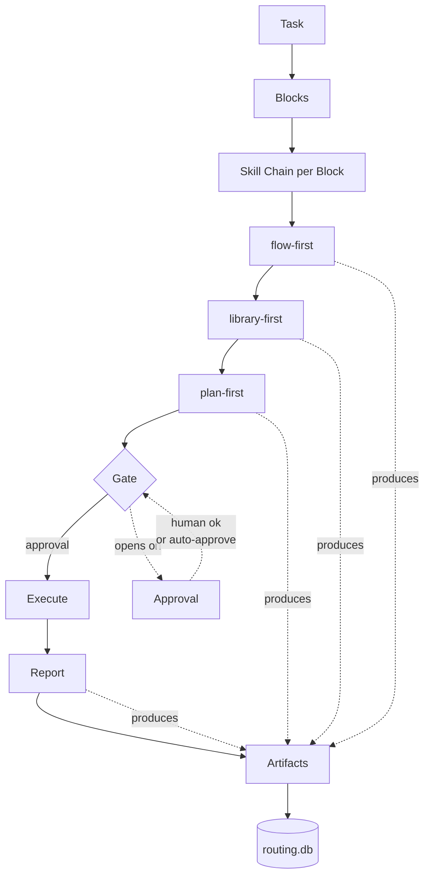

[English](./README.md) · [Русский](./README.ru.md)

# The Framework

**Artifact-first agent-фреймворк для многоэтапных инженерных задач через
дисциплинированную цепочку скиллов — один блок за раз, один коммит за раз,
каждое решение зафиксировано в файле.**

Каждый шаг AI-агента пишет файл. Каждый файл регистрируется в локальной
базе. Каждый блок закрывается отчётом. Ничего не живёт только в чате.

---

## Почему artifact-first

Обычная работа с AI-агентом не оставляет следов. Агент думает, решает,
правит код — и эти решения испаряются в момент закрытия сессии. Ревьюер
не может проверить, что было рассмотрено и отклонено. Регрессии не
атрибутируются. Следующая сессия начинается с нуля.

Фреймворк решает это на уровне протокола. Каждый скилл (`flow-first`,
`library-first`, `plan-first`, ...) контрактно обязан произвести first-class
файл — таблицу landscape, оценку LOC, decision-документ, отчёт — и
зарегистрировать его в `routing.db`. Если шаг не создал артефакт — шага
не было.

Одно это правило превращает работу с AI из чата в аудируемую инженерную
запись.

---

## Как мы сравниваемся

| Ось | Прескриптивные фреймворки (напр. Molyanov ai-dev) | Executable-оркестраторы (LangChain, CrewAI) | Raw Claude Code / Cursor rules | **Этот фреймворк** |
|---|---|---|---|---|
| **Что поставляется** | Документация (роли, правила, чек-листы), применяешь руками | Python-рантайм + граф агентов, кодишь на нём | Системные промпты + rule-файлы | Скиллы + tooling + реестр артефактов |
| **Артефакты как first-class** | ❌ Только проза | ⚠️ Опционально / ad-hoc trace | ❌ Эфемерный чат | ✅ Каждый шаг пишет tracked-файл |
| **Cross-block память** | ❌ На человеке | ⚠️ Зависит от вашей обвязки | ❌ Per-session | ✅ Реестр переживает сессии |
| **Approval gates** | ❌ Этикет / prose-правила | ⚠️ Callback-хуки, которые вы вешаете | ❌ Доверие модели | ✅ Enforced протокольными скиллами |
| **Онбординг** | Часы чтения доков → применение | Изучение API + сборка workflow | Копирование rules → надежда | `git clone → bin/init → bin/new-project → bin/flow-ui/serve` |
| **Lock-in** | Ноль — это книга | Рантайм + vendor SDK | Editor-specific | Plain markdown + bash + sqlite |
| **Язык скиллов** | Domain-жаргон | Python | Промпты модели | Обычный markdown, редактируется |

Разные инструменты для разных задач. Если формализуете процесс большой
команды — подходит прескриптивный фреймворк. Если строите автономных
агентов at scale — подходит LangChain / CrewAI. Этот фреймворк подходит
когда нужна **дисциплина без рантайма** — каждый шаг каждой задачи
аудируем, но поддерживать нечего кроме файлов.

---

## Для кого

| Подходит | Не лучший fit |
|---|---|
| Solo или small-team инженеры с Claude Code (или любым агентом с named skills) | Крупные команды с отдельной process-организацией — прескриптивный фреймворк совпадёт с вашим языком лучше |
| Тем, кому нужен **audit trail** через много блоков, недель и сессий | Тем, кому нужен **hosted runtime** и prebuilt agent-графы — подойдут LangChain / CrewAI |
| Тем, кто предпочитает plain markdown + bash + git новым SDK | Тем, кому нужен Windows-first bash tooling out of the box (здесь Unix-first) |

Если ты один или в маленькой команде, делаешь инженерную работу с
агентом, и часто ловишь себя на мысли «жаль, что нет записи, почему мы
это сделали» — ты в целевой аудитории.

---

## Архитектура

После инициализации workspace выглядит так:

```
workspace-root/
├── aihub/               # Центральный реестр скиллов — один источник, много потребителей
│   └── .claude/
│       ├── skills/      # 12 скиллов (protocol + core)
│       └── commands/    # 2 slash-команды (/go-start, /go-fast)
├── projects/            # Твои проекты — каждый symlink'ит скиллы из aihub
│   ├── my-app/.claude/skills → ../../aihub/.claude/skills
│   └── another/.claude/skills → ../../aihub/.claude/skills
├── tasks/               # Единое хранилище задач через все проекты
│   ├── routing.db       # SQLite — task_artifacts, blocks, deploys
│   └── log/             # Папки на каждую задачу со всеми артефактами
├── bin/                 # Workspace tooling
│   ├── init             # First-run wizard
│   ├── new-project      # Регистрация нового проекта
│   ├── sync-from-aihub.sh    # Pull обновлений скиллов из upstream
│   └── flow-ui/         # Локальный веб-браузер над routing.db
├── docs/                # Документация фреймворка
└── manifest.yml         # Что shipping (15 entries: 2 cmd + 4 protocol + 8 core + 1 tool)
```

**Hub-and-spoke скиллы.** Все проекты шарят один `aihub/.claude/skills/`
через symlink — правишь скилл один раз, каждый проект видит изменение
на следующем вызове. Никакой per-project дублирующей копии, никакого drift.

**Единое хранилище задач.** Задачи из каждого проекта пишут в одну и ту
же `routing.db`. Cross-project запросы («что мы трогали на этой неделе?»)
работают нативно.

---

## One-page flow



Каждый блок двигается слева направо через цепочку. Каждый узел с меткой
«produces» пишет артефакт в `routing.db`. Gate останавливает цепочку до
момента, когда Approval её откроет — от человека, или от `dev-auto-first`,
который валидирует предыдущий артефакт по чек-листу и auto-approve'ит.

---

## Flow UI

`bin/flow-ui/` — локальный веб-браузер над `routing.db` + `task_artifacts`
+ файловыми системами твоих проектов. Работает на `127.0.0.1:8765`,
read-only против БД, без auth, без облака.

```bash
bash bin/flow-ui/serve    # старт (idempotent, в фоне)
bash bin/flow-ui/status   # проверить
bash bin/flow-ui/stop     # остановить
```

Затем открываешь `http://127.0.0.1:8765/`. Видишь: проекты, задачи
по проектам, блоки по задачам, артефакты по блокам, деплои и аналитику
использования скиллов. Никакого редактирования YAML. Никаких CLI-запросов.
Открыл и смотришь.

<!-- TODO: swap TBD for the real Loom share URL after recording block 50.
     Optional: uncomment the gif preview once docs/assets/loom-preview.gif is uploaded. -->
▶️ **[Посмотреть 90-сек демо на Loom](https://www.loom.com/share/TBD)**

<!--  -->

---

## Установка

```bash
git clone <this-repo> framework
cd framework
bash bin/init                        # 3-вопросный wizard пишет framework.yml
bash bin/new-project my-first-app    # регистрация проекта
bash bin/init-sample                 # опционально: populated demo-tour
```

Четыре команды (пять с demo). `bin/init` спрашивает 3 значения: расположение
aihub (по умолчанию: bundled `./aihub`), опциональный deploy-сервер,
опциональный Telegram-relay. Пустой ввод оставляет дефолт. `bin/init-sample`
опциональный — добавляет проект `sample-app` с одной завершённой задачей и
полной цепочкой артефактов, чтобы Flow UI показал реальный контент с первого
serve. Удалить позже: `bash bin/archive-sample`.

`bin/new-project <id>` создаёт `projects/<id>/.claude/skills` как symlink
на `aihub/.claude/skills` и дописывает запись в `aihub/projects.yml`.

---

## Первый запуск

```bash
cd projects/my-first-app
claude                               # или любой агент, поддерживающий Skill('name')
/go-fast "fix the null-check in email_service.py"
```

Следуй цепочке — `flow-first` спросит anchors, `library-first` покажет
LOC-таблицу с тем, что переиспользуется vs новое, `plan-first` покажет
план до касания кода. Одобряешь — агент выполняет. Каждый артефакт
приземляется в `tasks/log/<slug>/`.

Открой `http://127.0.0.1:8765/` в другом окне терминала — увидишь, как
артефакты появляются по мере выполнения блока.

---

## Документация

- [`docs/CONCEPTS.md`](./docs/CONCEPTS.md) — глоссарий базовых терминов
  (artifact / task / block / skill / chain / gate / approval). Читать первым.
- [`docs/SKILLS_MAP.md`](./docs/SKILLS_MAP.md) — каждый shipping скилл:
  tier, роль, что вызывает, что производит.
- [`docs/SKILL_CONTRACT.md`](./docs/SKILL_CONTRACT.md) — стандарт написания
  файлов скиллов. Обязательное чтение при добавлении или изменении скилла.
- [`docs/PROJECTS_GUIDE.md`](./docs/PROJECTS_GUIDE.md) — паттерн
  hub-and-spoke по проектам в деталях.
- [`docs/QUICKSTART.md`](./docs/QUICKSTART.md) — walkthrough из 5 шагов.
- [`docs/AUTO_DEPLOY_RECIPE.md`](./docs/AUTO_DEPLOY_RECIPE.md) — opt-in
  git-push auto-deploy паттерн (bare repo + post-receive + snapshot backups).
- [`CONTRIBUTING.md`](./CONTRIBUTING.md) — как добавить / изменить скилл,
  contract compliance, PR flow.
- [`CHANGELOG.md`](./CHANGELOG.md) — semver release history.
- [`FAQ.md`](./FAQ.md) — 10 частых вопросов с честными ответами.
- [`SECURITY.md`](./SECURITY.md) — политика раскрытия уязвимостей.
- [`CODE_OF_CONDUCT.md`](./CODE_OF_CONDUCT.md) — Contributor Covenant v2.1.
- [`docs/ANTI_PATTERNS.md`](./docs/ANTI_PATTERNS.md) — что artifact-first structurally предотвращает.

---

## Требования

- **bash 3.2+** (macOS default) или новее
- **python3** (любой recent 3.x) — используется для YAML-парсинга в `bin/*.sh`
- **sqlite3** — для routing-базы
- **git** — для истории артефактов

Flow UI дополнительно требует Python-пакеты: `fastapi`, `uvicorn`,
`pyyaml`, `jinja2` (устанавливаются через `pip install -r bin/flow-ui/requirements.txt`).

Никаких сервисов. Никаких package-managers кроме pip для Flow UI.

---

## Tooling

- `bin/init` — first-run wizard.
- `bin/new-project <id>` — регистрация нового проекта (symlink + запись в реестре).
- `bin/sync-from-aihub.sh` — pull обновлений скиллов из upstream aihub источника.
- `bin/gen-skills-map.sh` — регенерация `docs/SKILLS_MAP.md` из манифеста.
- `bin/verify-contract.sh` — линт каждого скилла по `docs/SKILL_CONTRACT.md`.
- `bin/flow-ui/serve|status|stop` — локальный веб-браузер.

---

## Статус

**MVP-релиз — 14 скиллов + 1 tool, manifest v0.5.0.**

14 shipping скиллов (2 slash-команды + 4 протокольных скилла + 8 core-скиллов)
функциональны и используются ежедневно на реальной production-работе.
Flow UI — sibling-инструмент, синкающийся из upstream-репо через tier
`tool`. Обвязка (contract verifier, skills map generator, init wizard,
sync script, Discussions/Issue templates) стабильна для публичного релиза.

CI workflow (`.github/workflows/verify-contract.yml`) и полный v1.0.0-mvp
тэг — последние шаги release roadmap'а.

---

## Лицензия

Выпущено под MIT License — см. [LICENSE](./LICENSE).

Публичный зеркало: [github.com/bearded-illirian/framework](https://github.com/bearded-illirian/framework)
