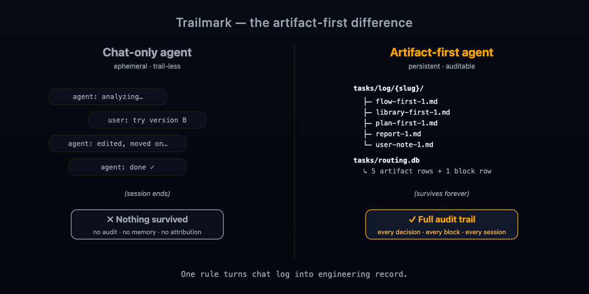
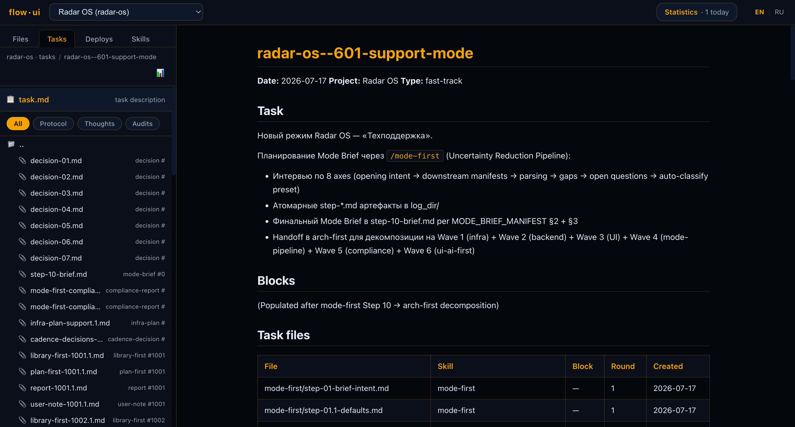
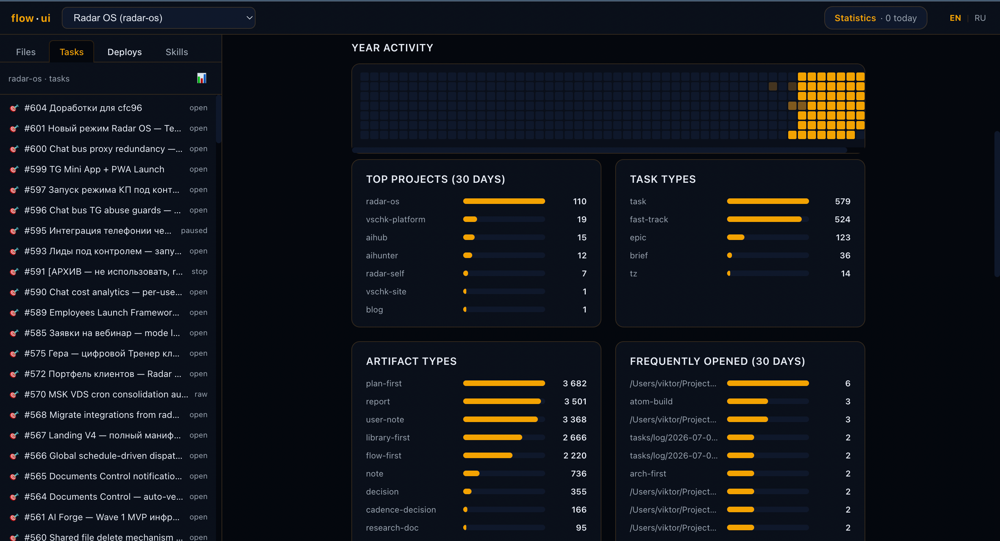
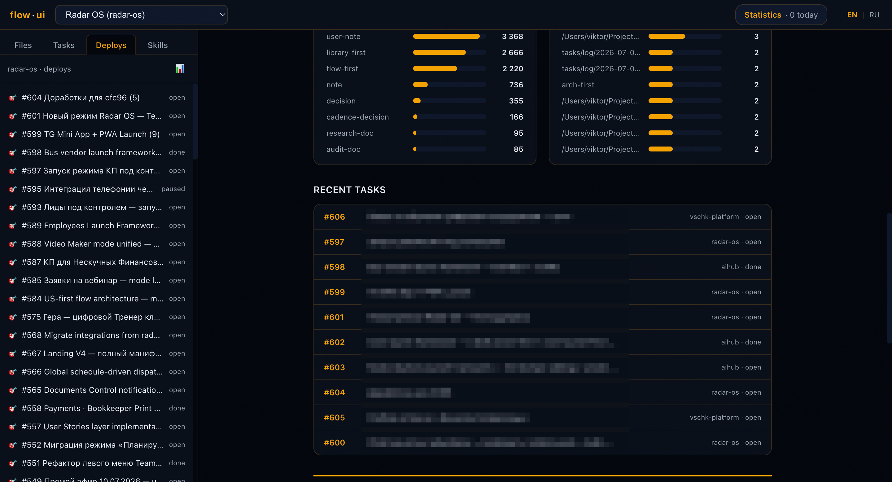
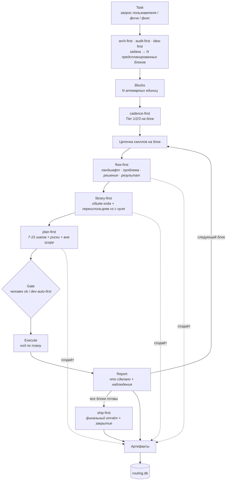
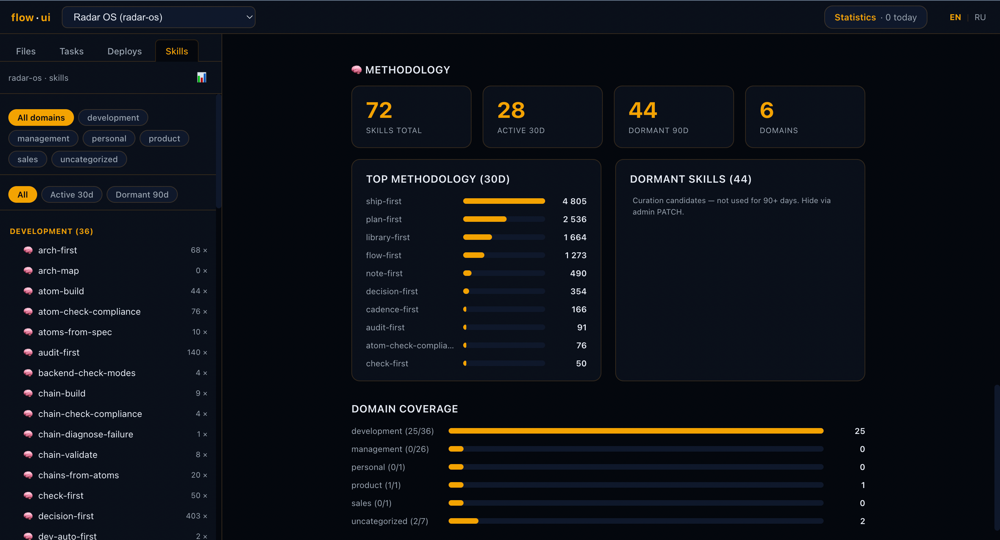
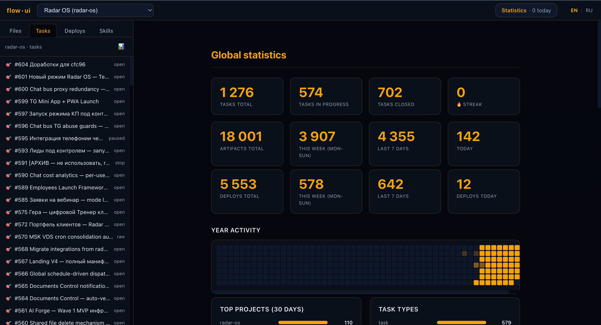

[English](./README.md) · [Русский](./README.ru.md)

[](https://opensource.org/licenses/MIT)
[](./manifest.yml)
[](./docs/SKILLS_MAP.md)
[](https://github.com/bearded-illirian/trailmark/stargazers)
[](https://github.com/bearded-illirian/trailmark/issues)

# Trailmark

**Artifact-first фреймворк агентов для многоэтапных инженерных задач через
дисциплинированную цепочку скиллов — один блок за раз, один коммит за раз,
каждое решение записано в файл.**

Каждый шаг AI-агента создаёт файл. Каждый файл регистрируется в локальной
базе. Каждый **блок** *(единица работы внутри задачи)* закрывается
**отчётом** *(итоговая markdown-сводка после выполнения)*. Ничего не
живёт только в чате.



**Найти любой артефакт — решение, план, отчёт, заметку — за 3-4 клика.**



<p align="center"><em>Больше не надо в чате: «Клод, напомни что там было в той задаче на прошлой неделе». Открыл Flow UI, кликнул на задачу — видишь все файлы что создал блок. Можно перечитать, найти нужное, они реально существуют.</em></p>

---

## Какие проблемы решает Trailmark

Три боли каждого разработчика на Claude Code — и как Trailmark структурно
предотвращает каждую.

### 1. Забывчивость сессий — «а что мы вчера решали?»

Чаты эфемерны. Каждое новое окно = сброс контекста. Через две недели
ты не помнишь, почему выбрал подход X, какие альтернативы рассматривал,
что вчерашний агент сделал и зачем.

**Ответ Trailmark:** каждое решение пишет файл — `flow-first-N.md`
(ландшафт), `library-first-N.md` (оценка объёма + переиспользуемое vs
с нуля), `plan-first-N.md` (план на 7-15 шагов), `report-N.md` (что
сделано + наблюдения), `decision-N.md` (любой значимый выбор с
альтернативами). Ищешь по архиву за секунды. **Не нужно помнить — читаешь.**

### 2. Непредсказуемое качество — «повезло или нет»

Бросаешь агенту «сделай X» и надеешься. Иногда результат отличный, иногда
халтура. Причина: нет обязательной подготовки — агент каждый раз сам
решает, как подойти.

**Ответ Trailmark:** обязательная цепочка скиллов. Каждый блок **обязан**
пройти `flow-first` (таблица понимания) → `library-first` (оценка объёма
кода) → `plan-first` (7-15 шагов) **до касания кода**. Если агент
попытался пропустить — блок не считается закрытым. **Стабильное качество
на каждый блок.**

### 3. Расследование регрессий — «сломалось, но когда и почему?»

Что-то работало неделю назад, сегодня падает. `git blame` показывает
«fix bug» без контекста. Какое решение AI привело к регрессии?

**Ответ Trailmark:** каждый артефакт регистрируется в `routing.db` с
временем, номером блока, ID задачи. При регрессии: `SELECT` блоков,
которые касались файла → читаешь `plan-first-N.md` для контекста →
`git blame` показывает хеш коммита. **Регрессия → блок → решение →
исходник за 30 секунд.**

**Результат:** работа с AI становится стабильной и предсказуемой —
каждое решение аудируемо, каждая регрессия отслеживается, каждая
сессия продолжается с того места, где закончилась предыдущая.

---

## Почему artifact-first

**Без artifact-first:**

- Решения испаряются в момент закрытия сессии
- Ревьюер не может проверить, что было рассмотрено, а что отклонено
- Регрессии не отслеживаются до конкретного изменения
- Следующая сессия начинается с нуля — без памяти между блоками

**С artifact-first — правило этого фреймворка:**

- Каждый **скилл** *(переиспользуемый протокол типа `flow-first` или `plan-first`)* обязан создать первоклассный файл (таблицу ландшафта, оценку объёма, документ решения, отчёт)
- Каждый файл регистрируется в `routing.db`
- Если шаг не создал артефакт — **шага не было**

Чат-лог → аудируемая инженерная запись. **Одно правило, закреплённое протоколом.**

**Видно куда реально уходит время AI — без ручных аудитов.**



<p align="center"><em>Какие проекты доминируют. Какие типы задач чаще всего. Какие артефакты создаются. Живые цифры из реальной работы, а не «вроде много рефакторили».</em></p>

---

## Как мы сравниваемся

| Ось | Прескриптивные фреймворки на документации | Исполняемые оркестраторы (LangChain, CrewAI) | Правила внутри редактора (напр. Cursor rules) | **Этот фреймворк** |
|---|---|---|---|---|
| **Что поставляется** | Документация (роли, правила, чек-листы), применяешь руками | Python-рантайм + граф агентов, кодишь на нём | Системные промпты + правила | Скиллы + инструментарий + реестр артефактов |
| **Артефакты как первоклассные** | ❌ Только проза | ⚠️ Опционально / случайные trace | ❌ Эфемерный чат | ✅ Каждый шаг пишет отслеживаемый файл |
| **Память между блоками** | ❌ На человеке | ⚠️ Зависит от вашей обвязки | ❌ Только текущая сессия | ✅ Реестр переживает сессии |
| **Гейты одобрения** | ❌ Этикет / текстовые правила | ⚠️ Хуки, которые вы вешаете | ❌ Доверие модели | ✅ Обеспечены протокольными скиллами |
| **Онбординг** | Часы чтения доков → применение | Изучение API + сборка workflow | Копирование правил → надежда | `git clone → bin/init → bin/new-project → bin/flow-ui/bin/serve` |
| **Привязка** | Ноль — это книга | Рантайм + вендорский SDK | Только под редактор | Обычный markdown + bash + sqlite |
| **Язык скиллов** | Профессиональный жаргон | Python | Промпты модели | Обычный markdown, редактируется |

Разные инструменты для разных задач. Если формализуете процесс большой
команды — подходит прескриптивный фреймворк. Если строите автономных
агентов at scale — подходит LangChain / CrewAI. Этот фреймворк подходит
когда нужна **дисциплина без рантайма** — каждый шаг каждой задачи
аудируем, но поддерживать нечего кроме файлов.

_Примечание: этот фреймворк работает поверх Claude Code (или любого
агента, поддерживающего вызов `Skill('name')`). Сравнение выше — против
категорий методологии, не против самого агентного окружения. Claude Code
— рантайм на котором мы строимся, не конкурент._

---

## Для кого

| Подходит | Не лучший вариант |
|---|---|
| Соло-разработчикам или небольшим командам на Claude Code (или любом агенте, поддерживающем именованные скиллы) | Крупным командам с отдельной процессной организацией — прескриптивный фреймворк совпадёт с вашим языком лучше |
| Тем, кому нужна **аудируемая история** через много блоков, недель и сессий | Тем, кому нужен **готовый хостинг рантайма** и предсобранные графы агентов — подойдут LangChain / CrewAI |
| Тем, кто предпочитает обычный markdown + bash + git новым SDK | Тем, кому нужен Windows-first bash-инструментарий из коробки (здесь Unix-first) |

Если ты один или в маленькой команде, делаешь инженерную работу с
агентом, и часто ловишь себя на мысли «жаль, что нет записи, почему мы
это сделали» — ты в целевой аудитории.

---

## Архитектура

После инициализации workspace выглядит так:

```
workspace-root/
├── aihub/               # Центральный реестр скиллов — один источник, много потребителей
│   └── .claude/
│       ├── skills/      # 17 скиллов (protocol + core)
│       └── commands/    # 2 slash-команды (/go-start, /go-fast)
├── projects/            # Твои проекты — каждый symlink'ит скиллы из aihub
│   ├── my-app/.claude/skills → ../../aihub/.claude/skills
│   └── another/.claude/skills → ../../aihub/.claude/skills
├── tasks/               # Единое хранилище задач через все проекты
│   ├── routing.db       # SQLite — task_artifacts, blocks, deploys
│   └── log/             # Папки на каждую задачу со всеми артефактами
├── bin/                 # Инструментарий workspace
│   ├── init             # Мастер первого запуска
│   ├── new-project      # Регистрация нового проекта
│   ├── sync-from-aihub.sh    # Загрузка обновлений скиллов из upstream
│   └── flow-ui/         # Локальный веб-браузер над routing.db
├── docs/                # Документация фреймворка
└── manifest.yml         # Что поставляется (20 записей: 2 cmd + 4 protocol + 13 core + 1 tool)
```

**Скиллы по схеме hub-and-spoke.** Все проекты используют один
`aihub/.claude/skills/` через symlink — правишь скилл один раз, каждый
проект видит изменение на следующем вызове. Никаких копий на проект,
никакого расхождения.

**Единое хранилище задач.** Задачи из каждого проекта пишут в одну и ту
же `routing.db`. Запросы через проекты («что мы трогали на этой неделе?»)
работают нативно.

**Сломалось после деплоя? Найти причину — за 2 клика, без разбора истории коммитов.**



<p align="center"><em>В Flow UI кликаешь на нужный деплой — справа открывается заметка того блока: что делали, почему приняли именно такое решение, куда смотреть первым делом. Не нужно вручную сравнивать состояния файлов между коммитами или расспрашивать AI «а что мы тогда меняли».</em></p>

---

## Схема работы



Задача сначала проходит через **скилл-декомпозицию** — `arch-first`
для фич, `audit-first` для фиксов, `idea-first` для новых продуктов —
который режет её на N предспланированных блоков. `cadence-first` затем
назначает каждому блоку уровень (Tier 1/2/3), чтобы правильно
масштабировать цепочку скиллов.

На каждый блок: цепочка идёт слева направо — `flow-first` →
`library-first` → `plan-first`. **Gate** останавливает выполнение
пока его не откроет либо человек через `ok`, либо `dev-auto-first`,
который валидирует предыдущий артефакт по чек-листу и автоматически
одобряет.

После Execute + Report цикл возвращается к следующему блоку. Когда
все блоки готовы, `ship-first` пишет финальную сводку задачи и
закрывает её. Каждый артефакт — от декомпозиции до `ship-first` —
приземляется в `routing.db`.

---

## Flow UI

`bin/flow-ui/` — локальный веб-браузер над `routing.db` + `task_artifacts`
+ файловыми системами твоих проектов. Работает на `127.0.0.1:8765`,
только чтение из базы, без авторизации, без облака.

```bash
bash bin/flow-ui/bin/serve    # старт (идемпотентно, в фоне)
bash bin/flow-ui/bin/status   # проверить
bash bin/flow-ui/bin/stop     # остановить
```

Затем открываешь `http://127.0.0.1:8765/`. Видишь: проекты, задачи
по проектам, блоки по задачам, артефакты по блокам, деплои и аналитику
использования скиллов. Никакого редактирования YAML. Никаких запросов
из командной строки. Открыл и смотришь.

**Какие скиллы срабатывают чаще, какие мертвы — видно до того, как решишь добавить ещё один.**



<p align="center"><em>Не «кажется, нужен ещё скилл для X» — реальные счётчики. Ship-first в топе, потому что каждый блок им заканчивается. Спящие скиллы — кандидаты на удаление или обновление. Покрытие по доменам показывает где работа идёт через протоколы, а где ad-hoc.</em></p>

---

## Установка

```bash
git clone <this-repo> framework
cd framework
bash bin/init                        # мастер из 3 вопросов пишет framework.yml
bash bin/init-demo                   # рекомендуется: 3 проекта × 2 задачи с наполнением
bash bin/new-project my-first-app    # регистрация своего проекта
```

Три команды, ~1 минута. `bin/init` спрашивает 3 значения: расположение
aihub (по умолчанию: bundled `./aihub`), опциональный deploy-сервер,
опциональный Telegram-relay. Пустой ввод оставляет значение по
умолчанию.

`bin/init-demo` заполняет workspace **3 демо-проектами × 2 задачи × 5
артефактов каждая** (123 строки + 6 папок), чтобы Flow UI показал
реалистичное содержимое с первого запуска. Каждая строка помечена
`is_demo=1` и трекается в `tasks/.demo-manifest.json`. Удаляется чисто
позже: `bash bin/archive-demo` (защита по 3 маркерам — твои реальные
данные никогда не тронуты). См. [`docs/DEMO_DATA.md`](./docs/DEMO_DATA.md)
для полного описания гарантий.

`bin/new-project <id>` создаёт `projects/<id>/.claude/skills` как symlink
на `aihub/.claude/skills` и дописывает запись в `aihub/projects.yml`.

---

## Первый запуск

```bash
cd projects/my-first-app
claude                               # или любой агент, поддерживающий Skill('name')
/go-start
/go-fast "добавить hello-функцию в greetings.py"
```

Следуй цепочке — `flow-first` спросит опорные точки, `library-first`
покажет таблицу объёма кода с тем, что переиспользуется vs новое,
`plan-first` покажет план до касания кода. Одобряй каждый гейт (`ok`
на flow-first, `ok` на library-first, `1` на plan-first для автопилота).
Агент выполняет. Каждый артефакт приземляется в `tasks/log/<slug>/`.

Открой `http://127.0.0.1:8765/` в другом окне терминала — увидишь, как
артефакты появляются по мере выполнения блока.

### Проверка через /tutorial-check

После завершения первой реальной задачи запусти:

```
/tutorial-check
```

Поставляемый скилл `tutorial-check` валидирует твою настройку через
5-6 SQL и файловых проверок — рапортует ✅/❌ по каждому шагу, чтобы
ты точно знал, что легло правильно, а что требует внимания. Полный
проход домашки: [`docs/QUICKSTART.md`](./docs/QUICKSTART.md) § 5.

---

## Документация

- [`docs/CONCEPTS.md`](./docs/CONCEPTS.md) — глоссарий базовых терминов
  (артефакт / задача / блок / скилл / цепочка / гейт / одобрение).
  Читать первым.
- [`docs/SKILLS_MAP.md`](./docs/SKILLS_MAP.md) — каждый поставляемый
  скилл: тир, роль, что вызывает, что производит.
- [`docs/SKILL_CONTRACT.md`](./docs/SKILL_CONTRACT.md) — стандарт
  написания файлов скиллов. Обязательное чтение при добавлении или
  изменении скилла.
- [`docs/PROJECTS_GUIDE.md`](./docs/PROJECTS_GUIDE.md) — паттерн
  hub-and-spoke по проектам в деталях (включая раздел Advanced:
  локальные переопределения скиллов на проект).
- [`docs/QUICKSTART.md`](./docs/QUICKSTART.md) — walkthrough из 5 шагов
  с домашкой.
- [`docs/DEMO_DATA.md`](./docs/DEMO_DATA.md) — гайд по демо-датасету
  (init-demo, archive-demo, защита по 3 маркерам).
- [`docs/TROUBLESHOOTING.md`](./docs/TROUBLESHOOTING.md) — топ проблем
  и их починка.
- [`docs/AUTO_DEPLOY_RECIPE.md`](./docs/AUTO_DEPLOY_RECIPE.md) —
  опциональный паттерн автодеплоя через `git push` (bare repo +
  post-receive + snapshot backups).
- [`CONTRIBUTING.md`](./CONTRIBUTING.md) — как добавить / изменить
  скилл, соответствие контракту, поток PR.
- [`CHANGELOG.md`](./CHANGELOG.md) — история релизов по semver.
- [`FAQ.md`](./FAQ.md) — 10 частых вопросов с честными ответами.
- [`SECURITY.md`](./SECURITY.md) — политика раскрытия уязвимостей.
- [`CODE_OF_CONDUCT.md`](./CODE_OF_CONDUCT.md) — Contributor Covenant v2.1.
- [`docs/ANTI_PATTERNS.md`](./docs/ANTI_PATTERNS.md) — что artifact-first
  структурно предотвращает.

---

## Требования

- **bash 3.2+** (по умолчанию на macOS) или новее
- **python3** (любой актуальный 3.x) — используется для парсинга YAML в `bin/*.sh`
- **sqlite3** — для базы routing.db
- **git** — для истории артефактов

Flow UI дополнительно требует Python-пакеты: `fastapi`, `uvicorn`,
`pyyaml`, `jinja2` (устанавливаются через
`pip install -r bin/flow-ui/requirements.txt`).

Никаких сервисов. Никаких package-менеджеров кроме pip для Flow UI.

---

## Инструменты

- `bin/init` — мастер первого запуска.
- `bin/new-project <id>` — регистрация нового проекта (symlink + запись в реестре).
- `bin/sync-from-aihub.sh` — загрузка обновлений скиллов из upstream aihub.
- `bin/gen-skills-map.sh` — регенерация `docs/SKILLS_MAP.md` из манифеста.
- `bin/verify-contract.sh` — линтер каждого скилла по `docs/SKILL_CONTRACT.md`.
- `bin/flow-ui/bin/serve|status|stop` — локальный веб-браузер.

---

## Статус

**Текущий релиз — 19 скиллов + 1 инструмент, manifest v1.0.0.**

19 поставляемых скиллов (2 slash-команды + 4 протокольных скилла + 13
core-скиллов) функциональны и используются ежедневно на реальной
production-работе. Flow UI — сопутствующий инструмент, синхронизирующийся
из upstream-репо через тир `tool`. Обвязка (проверка контракта,
генератор карты скиллов, мастер инициализации, скрипт синхронизации,
шаблоны Discussions/Issues) стабильна для публичного релиза.

**Не демо — это боевая система автора.**



<p align="center"><em>3 месяца ежедневного использования → 18 тыс. артефактов, 1276 задач, 5,5 тыс. деплоев, 6 доменов, 72 активных скилла. На Trailmark каждый день делается реальная инженерная работа. Каждое решение в дизайне прошло стресс-тест на этом масштабе.</em></p>

CI-workflow валидирует контракты на каждом push. Первый стабильный
релиз v1.0.0 tag'нут — см. [Releases](../../releases/tag/v1.0.0).

### Работаешь на Codex / Cursor / другом агенте?

Сейчас Trailmark работает только на Claude Code. Если хочешь использовать
на другом агенте — оставь комментарий в [Discussion #1](https://github.com/bearded-illirian/trailmark/discussions/1)
с указанием платформы. **Наберём 10+ голосов — сделаю порт в приоритете.**

---

## Лицензия

Выпущено под MIT — см. [LICENSE](./LICENSE).

Публичное зеркало: [github.com/bearded-illirian/trailmark](https://github.com/bearded-illirian/trailmark)
