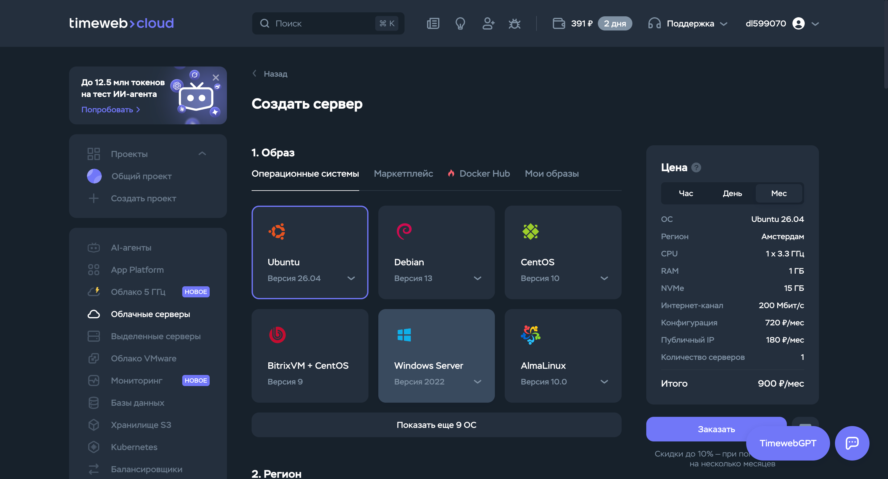
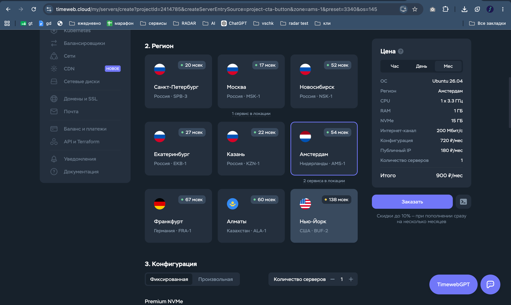
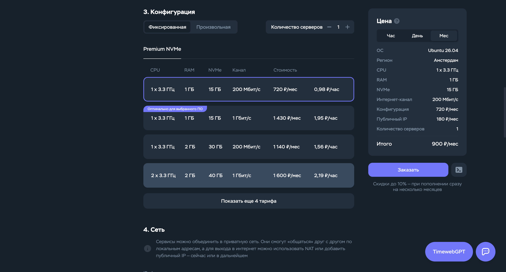
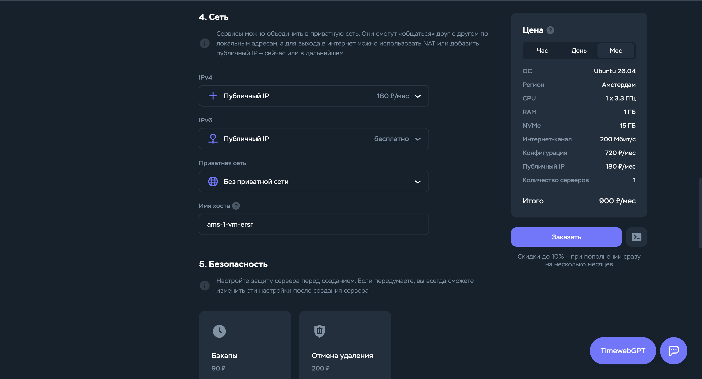
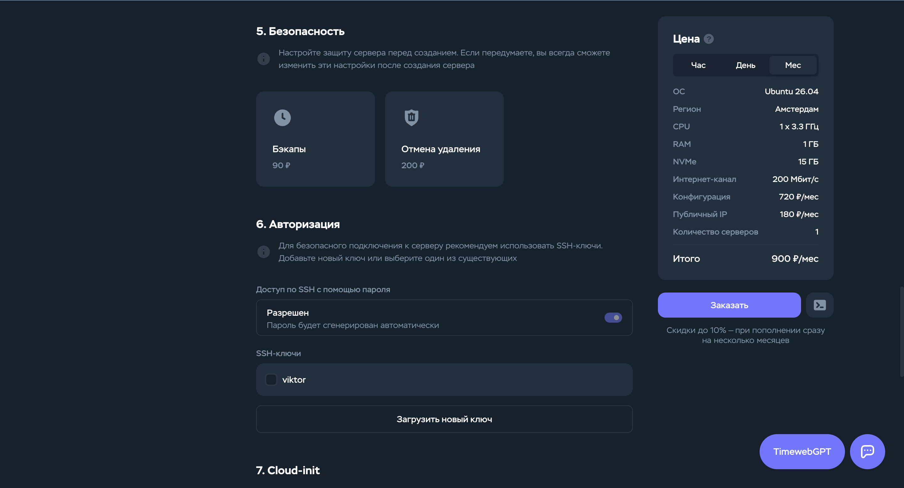
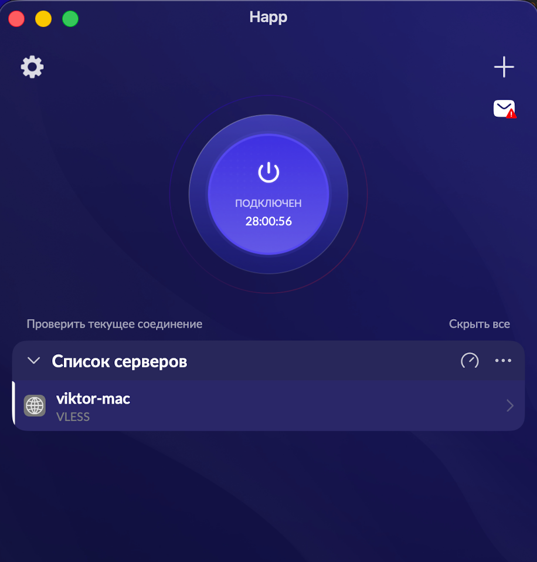
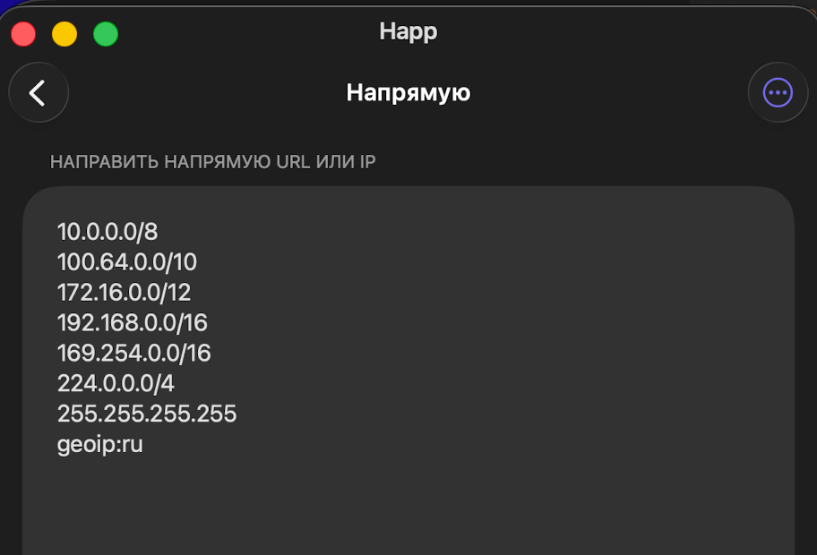

> 🔗 Task: /Users/viktor/Projects/vschk-platform/tasks/log/2026-07-22-vschk-platform--622-vpn-via-ai-coder-course/task.md

# Как собрать свой VPN за 1 час

**Оглавление:**

1. [Про курс: что получишь и что нужно](#глава-1--про-курс-что-получишь-и-что-нужно) ✅
2. [Заказ VDS Timeweb за 5 минут](#глава-2--заказ-vds-timeweb-за-5-минут) ✅
3. [Свой домен + DNS (опционально)](#глава-3--свой-домен--dns-опционально) ✅
4. [Готовый промпт для AI-кодера](#глава-4--готовый-промпт-для-ai-кодера) ✅
5. [Что делает AI под капотом](#глава-5--что-делает-ai-под-капотом) ✅
6. [Ставим Happ + подключаемся](#глава-6--ставим-happ--подключаемся) ✅
7. [Split Tunneling — RU-сайты напрямую](#глава-7--split-tunneling--ru-сайты-напрямую) ✅
8. [Ремонт через AI когда что-то сломается](#глава-8--ремонт-через-ai-когда-что-то-сломается) ✅
9. [Итог + куда дальше](#глава-9--итог--куда-дальше) ✅

---

# Глава 1 — Про курс: что получишь и что нужно

Если ты 30 раз в день включаешь и выключаешь VPN — этот курс для тебя.

Ты знаешь этот танец. Claude работает только с VPN. КиноПоиск — только без. Госуслуги — без. Тот один клиент — без. GitHub — 50 на 50. Открываешь Slack, чтобы просто ответить коллеге — сначала думаешь секунду «а с ним или без».

А если ещё твой Cloudflare WARP (или где ты сейчас сидишь) начал ломаться раз в неделю и вообще не пускать к российским хостерам — добро пожаловать в клуб.

## Что получишь в итоге

За час пошагово соберёшь **свой личный VPN** на своём сервере. Не «купил в клубе», не «настроил через друга Пашу», а свой.

- **Стоит** ~1000₽/мес за сервер (700-1000 в зависимости от бэкапов и IP). Всё. Больше никаких «premium подписок»
- **Работает всё сразу**: и Claude, и КиноПоиск, и Госуслуги — без переключений
- **Твой контроль.** Хочешь добавить телефон жены — 30 секунд. Хочешь отобрать доступ у бывшего коллеги — 30 секунд. Никто из «сервиса VPN» не смотрит куда ты ходишь
- **Не палит бизнес-домены.** Трафик выходит с твоего IP, не с общего IP популярного VPN где сидит ещё десять тысяч человек
- **Скорость** — как у обычного интернета минус 10-15% на туннель. Хватает на всё с запасом

И главное: **больше не танцуешь с включалкой**. Один раз настроил — работает.

## Что нужно на входе

Три вещи:

1. **Ты уже работаешь в Claude Code, Cursor или Codex.** Это не «желательно», это критично. Мы соберём VPN не руками, а промптом — AI-кодер поднимет сервер за тебя. Если ты никогда не открывал Claude Code — сначала загляни в курс «AI-кодер за 20 часов», потом сюда
2. **Банковская карта** для оплаты сервера (~1000₽/мес). Российская подойдёт
3. **Час времени** без спешки. Не 30 минут между встречами, а час в спокойном режиме

## Что этот курс НЕ делает

Честно, чтобы никто не разочаровался:

- **Не про максимальную анонимность.** Мы делаем удобный рабочий VPN, а не «победим Роскомнадзор». Если ты активист или журналист под угрозой — тебе нужен Tor и другие инструменты, не это
- **Не про сверхскорость.** Обычная скорость твоего интернета минус ~15%. Для работы, стриминга и звонков хватает с запасом, но рекордов не поставишь
- **Не про торренты.** Технически можно, но провайдер сервера может ругаться. Не рекомендуется

## Как пройти курс

Читай подряд. Не прыгай. Каждая глава опирается на предыдущую:

1. Заказ сервера (5 минут в браузере)
2. Свой домен + DNS (по желанию, ещё 5 минут)
3. **Промпт для AI-кодера** — самое интересное, тут AI поднимает VPN
4. Что делает AI под капотом — короткий обзор, чтобы понимать что у тебя работает
5. Ставим Happ + подключаемся с телефона и мака
6. Split Tunneling — чтобы российские сайты работали напрямую
7. Ремонт через AI, когда что-то сломается
8. Итог + куда двигаться дальше

Погнали. Открывай следующую главу — заказываем сервер.

---

# Глава 2 — Заказ VDS Timeweb за 5 минут

Хостинг — берём чужой компьютер в стойке, ставим на него VPN, платим ~900₽/мес. Провайдеров таких много, я советую **Timeweb Cloud**:

- Российский биллинг — принимает российские карты, есть счета на юрлица
- Есть сервера в Амстердаме — это нам нужно (сервер должен быть **НЕ** в РФ)
- Стабильно работает — я держу на них рабочие сервера и VPN **больше 10 лет**
- ~900₽/мес за минимальную виртуалку — хватит с большим запасом

---

### 👉 Регистрируйся по моей реф-ссылке

## **[timeweb.cloud/?i=104973 →](https://timeweb.cloud/?i=104973)**

Это твоя благодарность мне за этот курс.

---

## Что заказываем

Идём в панель Timeweb Cloud → **«Облачные серверы»** → **«Создать сервер»**. Дальше по шагам сверху вниз:

### 1. Образ — Ubuntu 26.04

Выбирай **Ubuntu 26.04** (самый свежий LTS у Timeweb). Не Windows, не Debian, не CentOS — именно Ubuntu, её лучше всего знает любой AI-кодер.



### 2. Регион — Амстердам

Выбирай **Амстердам (Нидерланды, AMS-1)**. Если недоступен — **Франкфурт (Германия)** как альтернатива. Никаких российских локаций (СПб / Москва / Новосибирск / Екатеринбург / Казань) — весь смысл VPN в том чтобы выйти в интернет из-за границы РФ.



### 3. Конфигурация — минимальный тариф Premium NVMe

В таблице тарифов **выбирай первую строку** — самую дешёвую:

| CPU | RAM | NVMe | Канал | Цена |
|---|---|---|---|---|
| 1 × 3.3 ГГц | 1 ГБ | 15 ГБ | 200 Мбит | **720 ₽/мес** |

Timeweb сам подпишет этот тариф как «Оптимально для выбранного ПО». VPN очень лёгкий — минималки хватит с большим запасом.



### 4. Сеть — публичный IPv4

Обязательно включи **Публичный IPv4 (+180 ₽/мес)** — без него клиенты не смогут коннектиться к серверу. IPv6 бесплатный, приватная сеть не нужна. Имя хоста Timeweb сгенерирует автоматически (типа `ams-1-vm-ersr`) — можешь оставить как есть или переименовать в `my-vpn`.



### 5. Безопасность — включи Бэкапы

**Включи «Бэкапы» за 90 ₽/мес** — это дешёвая страховка на случай если сам себе сломаешь конфиг. Timeweb будет делать снапшот сервера раз в день и держать 7 штук. «Отмена удаления» опционально.

### 6. Авторизация — SSH-ключ

Загрузи свой SSH-ключ (обычно `~/.ssh/id_ed25519.pub`) через **«Загрузить новый ключ»**, назови как-нибудь. Пароль root Timeweb сгенерирует автоматически — сохрани его в 1Password / Bitwarden, хотя по факту заходить будем по SSH-ключу.



### Итого

**720 ₽ (сервер) + 180 ₽ (IPv4) + 90 ₽ (бэкапы) = 990 ₽/мес.** Округли до тысячи и не парься.

Жми **«Заказать»** внизу справа.


## Проверка

Через 2-3 минуты сервер поднимется — забери IP из панели, положи в блокнот, он нам понадобится в следующих главах.

Проверь подключение:

```bash
ssh root@ТВОЙ-IP
```

Если попал внутрь (`root@my-vpn:~#` или `root@ams-1-vm-ersr:~#`) — сервер твой, всё готово. `exit` — назад на мак.

---

> **Если застрял** — скинь эту главу и свой вывод ошибки своему AI-кодеру (Claude Code / ChatGPT / Cursor), спроси «что делать». Курс написан так, чтобы AI мог по нему объяснить или починить каждый шаг. SSH-ключи, `ssh-keygen`, копирование публичного ключа — стандартная тема, любой AI-кодер разберётся.

---

# Глава 3 — Свой домен + DNS (опционально)

Домен не обязателен — можно поднять VPN на голом IP. Но с доменом жизнь приятнее:

- **Красивый адрес** для подключения: `vpn.tvoyfamiliya.ru` вместо `195.201.15.42`
- **IP можно поменять** без перенастройки клиентов — обновил DNS-запись, все клиенты подхватили
- **Валидный TLS-сертификат** через Let's Encrypt — маскирует твой VPN под обычный HTTPS-сайт (снижает вероятность блокировки провайдером)

Если домена нет и заводить лень — пропускай главу. AI-кодер в следующей главе поднимет VPN в режиме **Reality** (маскировка под чужой сайт, домен не нужен).

## Что нужно

1. **Купить или выделить поддомен.** Есть у тебя `vasya.ru`? Заведи поддомен `vpn.vasya.ru`. Если домена нет — купи любой на **reg.ru** / **nic.ru** / **namecheap.com** (300-1000₽/год)
2. **Направить A-запись на IP сервера** в панели регистратора:

   | Поле | Значение |
   |---|---|
   | Тип | `A` |
   | Имя | `vpn` (или как назвал поддомен) |
   | Значение | IP из главы 2 |
   | TTL | 3600 (или дефолт) |

## Проверка

```bash
dig +short vpn.tvoyfamiliya.ru
```

Должен вернуть твой IP. Если пустой ответ — жди 5-10 минут, DNS обновляется не мгновенно.

Готово. Передадим домен AI-кодеру в следующей главе — он сам получит TLS-сертификат от Let's Encrypt и настроит VPN на этом домене.

---

> **Если DNS и A-записи для тебя тёмный лес** — начни с `reg.ru`, там русскоязычная панель и простые формы. Всё непонятное — скинь эту главу + скрин панели своему AI-кодеру, спроси «где здесь добавить A-запись `vpn` на IP `X`». Разберётся.

---

# Глава 4 — Готовый промпт для AI-кодера

Тут магия. Ты не пишешь bash-скрипты, не читаешь документацию Xray, не разбираешься с systemd. Открываешь Claude Code (или Cursor / Codex), скармливаешь наш промпт — AI за 10-15 минут поднимает VPN на твоём сервере.

## Что делаем

1. Открываешь свой любимый AI-кодер в пустой папке (можно `~/vpn-setup/`)
2. Копируешь **готовый промпт** отсюда:

   **[→ ai-coder-prompt.md](./ai-coder-prompt.md)** (детальный промпт с примерами, таблицами интеграций и вариантами настройки)

3. В первых трёх строках промпта подставляешь свои значения:
   - IP сервера (из главы 2)
   - Домен (из главы 3) или `none`
   - Твой Telegram-хендл (пойдёт в имя клиента для удобства)

4. Разрешаешь AI SSH и bash по мере запросов
5. Ждёшь пока в конце выдаст **VLESS URI + QR-код**

## Что происходит

AI-кодер SSH-ится на сервер, накатывает baseline (apt, UFW, fail2ban), ставит Xray-core, генерирует Reality-ключи, собирает `config.json`, стартует сервис, проверяет что порт слушает, и в конце даёт тебе готовую строку подключения.

**Займёт 10-15 минут** — бо́льшую часть времени это `apt upgrade`.

## Что делать когда закончит

1. **Скопируй VLESS URI** — понадобится в главе 6 для Happ
2. **Сохрани `privateKey` сервера** в 1Password / Bitwarden — понадобится при пересборке или переезде
3. **Сделай снапшот сервера** в панели Timeweb — на случай если что-то сломаешь. Обычно бесплатно, снапшот держится месяц

## Если AI застрял

- **Отказался коннектиться по SSH** — разреши явно: «да, коннектся по SSH, я контролирую сервер»
- **Упал на середине / потерял контекст** — скажи «продолжи с этапа N» — AI подхватит по состоянию сервера
- **Невалидный config.json** — попроси «проверь `xray -test -c /usr/local/etc/xray/config.json`, покажи вывод»

---

> **Если весь этот шаг — тёмный лес** — тебе всё равно нужен AI-кодер чтобы прогнать промпт. Скинь ему **эту главу** + **весь промпт** (следующий файл) + опиши что застряло. Пусть он тебя проведёт. Курс написан ровно под этот сценарий: AI выполняет, ты соглашаешься.

---

# Глава 5 — Что делает AI под капотом

Короткий разбор, чтобы ты понимал что у тебя работает и мог осмысленно чинить, если сломается.

## Стек — три компонента

| Компонент | Что делает | Файлы |
|---|---|---|
| **Xray-core** | Сам VPN-сервер. Слушает 443, принимает шифрованный трафик, релеит в интернет | `/usr/local/bin/xray` + `/usr/local/etc/xray/config.json` |
| **systemd** | Управляет процессом Xray — автостарт, рестарт при падении, логи | `/etc/systemd/system/xray.service` |
| **UFW** | Файрвол. Пускает только 22 (SSH) и 443 (VPN), остальное режет | `/etc/ufw/user.rules` |

Плюс `fail2ban` — банит IP, которые долбят SSH перебором.

> **По-человечески:** представь что твой сервер — это квартира. **Xray** — это ты, открываешь дверь гостям. **systemd** — будильник и няня одновременно: следит чтобы ты был на месте, а если ты вдруг упал в обморок — поднимает и ставит обратно у двери. **UFW** — стальная дверь с двумя глазка́ми: пускает только на нужные звонки (порты 22 и 443), остальным «нет никого дома». **fail2ban** — соседка, которая замечает если один и тот же чувак 3 раза дёрнул ручку без ключа, и заносит его в общий чёрный список подъезда.

Всё. Никаких docker, nginx, python, ноды. Один бинарник Xray + один JSON-конфиг + systemd.

## Почему VLESS + Reality (а не WireGuard / OpenVPN)

| Протокол | Плюсы | Минусы |
|---|---|---|
| **WireGuard** | Быстрый, простой, много клиентов | Открытые пакеты — DPI видит, провайдеры блокируют |
| **OpenVPN** | Проверенный, есть везде | Медленный, тоже детектится, старый |
| **IKEv2** | Нативно в iOS/Mac | Детектится, блокируется |
| **VLESS + Reality** | Маскируется под HTTPS-трафик к `www.apple.com` — DPI не отличит | Настройка чуть сложнее (но у нас AI-кодер) |

> **По-человечески про DPI:** *Deep Packet Inspection* — это когда провайдер не просто «пропускает пакеты», а нюхает каждый и говорит: «это WhatsApp», «это YouTube», «а вот это подозрительно похоже на VPN — придушу-ка». Российские провайдеры так делают на регулярной основе последние пару лет.
>
> **По-человечески про Reality:** твой VPN-сервер надевает маску-фотокарточку офиса Apple. DPI подходит, видит рожу с надписью «apple.com», выданную самими же Apple, и говорит: «а, свои, проходите». А внутри маски — ты со своим трафиком. Идея гениальная в своей простоте.

## Как течёт трафик

```
[iPhone / mac]
       │  шифрованный VLESS
       ▼
   Happ туннель
       │  выглядит как HTTPS к apple.com
       ▼
[твой VDS в Амстердаме, порт 443]
       │  Xray расшифровывает + релеит
       ▼
   Интернет
       │
       ▼
[Claude / YouTube / GitHub]
```

Провайдер РФ видит только шаг `iPhone → VDS`. Для него это трафик к «серверу apple.com», ничего необычного.

> **По-человечески:** твой iPhone — это ты, стоишь в РФ. Твой сервер в Амстердаме — это друг, у которого заграничный паспорт и он может ходить куда угодно. Ты передаёшь другу шифрованное письмо через закрытую дверь (это VLESS-туннель), друг открывает, читает «сходи-ка в KFC на углу» (это твой запрос к youtube.com), сходил, купил бургер, привёз обратно (ответ сайта). Провайдер видит только что ты общаешься с другом через дверь — а что вы там передаёте, не знает.

## Что AI изменил на сервере

После прогона промпта на сервере будет:

- `/usr/local/bin/xray` — бинарник Xray-core (сам VPN)
- `/usr/local/etc/xray/config.json` — весь конфиг: ключи, клиенты, настройки маскировки
- `/etc/systemd/system/xray.service` — инструкция для systemd «вот тебе бинарник, вот параметры запуска, следи чтобы жил»
- `/var/log/xray/access.log` + `error.log` — логи (пустые пока никто не подключался)

Плюс изменения в `/etc/ufw/`, `/etc/fail2ban/jail.d/sshd.local`, `/etc/hostname`.

> **По-человечески:** конфиг Xray — это как записка привратнику: «пускай только тех у кого вот эти три UUID, встречай их через маску apple.com, дальше не спрашивай». Всё что нужно для работы VPN — в одном JSON-файле. Хочешь добавить клиента — дописал строчку. Хочешь удалить — вычеркнул.

## Как посмотреть что происходит

Полезные команды когда что-то не так:

```bash
# Статус Xray
systemctl status xray

# Последние 50 строк логов
journalctl -u xray -n 50

# Кто сейчас подключён (по email клиента в access.log)
tail -f /var/log/xray/access.log

# Порт 443 слушается?
ss -tlnp | grep :443

# Файрвол активен?
ufw status verbose
```

> **По-человечески что это всё делает:**
> - `systemctl status` — «покажи как поживает мой Xray» (жив / упал / никогда не был запущен)
> - `journalctl` — «покажи что Xray писал в свой дневник» (ошибки, предупреждения, что ему не нравится)
> - `tail -f access.log` — «стой у окошка и говори мне каждый раз когда кто-то из моих зашёл»
> - `ss -tlnp | grep :443` — «на порту 443 сидит какой-то процесс или там пусто?»
> - `ufw status` — «файрвол вообще включён? какие двери открыты?»

Всё это можно скормить AI-кодеру со словами «вот вывод, что не так» — разберётся.

---

> **Если пока непонятно** — это ок. Знать что «Reality маскирует под apple.com» и «systemd рестартит Xray если упал» — уже достаточно. Все детали — по требованию, когда что-то сломается.

---

# Глава 6 — Ставим Happ + подключаемся

Сервер поднят, VLESS URI на руках. Осталось скормить его клиенту на телефоне или маке — и всё поедет.

## Почему Happ

Клиентов для VLESS/Xray много — v2rayNG, Streisand, V2Box, FoXray. Happ — мой дефолт:

- **iOS + macOS** одной кнопкой из App Store
- Поддерживает **Reality** (не все клиенты умеют, а нам нужно)
- Умеет **импорт по URI** и **скан QR** — не надо вводить 15 полей руками
- Есть **Split Tunneling** внутри (нужен в следующей главе)
- Бесплатный

> **По-человечески:** VPN-клиент — это как ключ от квартиры. Тебе нужен ключ, который подходит именно к твоей двери (Reality) и удобно ложится в карман (iOS/mac). Happ — про оба пункта сразу.

## Шаг 1 — Установка

**iOS / iPad:** App Store → поиск **«Happ»** → скачать. Иконка синий круг.

**Mac:** та же App Store, тот же Happ (одно приложение, работает и там и там).

## Шаг 2 — Импорт VLESS URI

Открой Happ. На главном экране — тап на **`+`** в правом верхнем углу.



Появится меню. Два варианта:

**Вариант A — из буфера.** Если URI из главы 4 у тебя в буфере обмена — жми **«Добавить из буфера»** / **«From Clipboard»**. Happ распарсит URI и создаст профиль автоматически.

**Вариант B — сканером QR.** Если AI-кодер вывел QR-код в терминале — жми **«Сканировать QR-код»**, наведи камеру на терминал. Тот же результат.

Появится новый профиль в списке серверов на главном экране.

> **По-человечески про URI:** строка `vless://...` — это твой ключ в текстовом виде. Всё что нужно клиенту чтобы подключиться (адрес сервера, порт, UUID, тип шифрования, публичный ключ Reality, имя маскировочного сайта) упаковано в одну строку. Можешь переслать её себе в мессенджер, положить в 1Password, скопировать в текстовик — работает откуда угодно. И заодно: **никому не давай этот URI**. Кто угодно с ним залезет на твой VPN и будет ходить в интернет через тебя.

## Шаг 3 — Подключение

Тапни на созданный профиль в списке.

Тапни на большую круглую кнопку в центре — **Connect**.

Первый раз iOS/mac спросит **«Разрешить VPN конфигурацию»** — жми **Разрешить** (Face ID / пароль на маке).

Через 1-2 секунды кнопка станет синей, побежит таймер `Подключён 0:00:01` — **VPN работает**.


> **По-человечески про «Разрешить VPN конфигурацию»:** iOS/mac спрашивает разрешения потому что VPN — это перехват всего трафика системы. Приложение говорит «отдай мне весь свой интернет, я его буду через свою трубу пускать». Разрешение даётся один раз для каждого профиля. Если жмёшь «Не разрешать» — VPN не заработает никогда, пока не удалишь и не переустановишь профиль.

## Шаг 4 — Проверка

Открой Safari, зайди на:

| URL | Что должен показать |
|-----|---------------------|
| `https://ipinfo.io/ip` | IP твоего VDS (тот что заказал в главе 2) |
| `https://whoer.net` | Твоя страна — **Netherlands / Amsterdam** |
| `https://claude.ai` | Открывается |
| `https://youtube.com` | Открывается |

Если все четыре ок — **всё работает**. Готово.

> **По-человечески:** первые два теста говорят «интернет думает что ты в Амстердаме». Третий и четвёртый — «сайты которые в РФ капризничают, теперь пускают». Ты на месте.

## Что сломалось

- **Happ не распарсил URI (импорт не создал профиль):** живая проблема, у меня самого была. VLESS URI с Reality-параметрами иногда парсится криво в зависимости от версии Happ. **Фикс:** скинь свой URI + скриншот Happ своему AI-кодеру, попроси «разобрать URI на отдельные поля (UUID, publicKey, shortId, SNI, port, flow) — я вобью вручную». Дальше в Happ жми `+` → «Ручной ввод» → VLESS → заполняешь по одному полю. Скучно, но надёжно (10 минут).
- **«Connection failed» сразу:** скопируй свой URI, скинь AI-кодеру, попроси «проверь URI на валидность и попробуй подключиться с сервера сам через `xray -test`»
- **Подключается, но интернета нет:** проблема на сервере, не на клиенте. Скинь AI-кодеру `journalctl -u xray -n 100` — разберётся
- **iOS блокирует установку VPN-профиля:** обновись до последней iOS. Старые версии иногда упрямятся

> **По-человечески если что-то не пошло** — скинь эту главу + скриншот экрана Happ + свой URI (обязательно **замажь UUID** — это твой пароль!) своему AI-кодеру, спроси «где я ошибся при импорте». В 90% случаев проблема на маке/iPhone, а не на сервере.

---

# Глава 7 — Split Tunneling — RU-сайты напрямую

Проблема: включил VPN — Claude работает, но КиноПоиск, MAX, Госуслуги, Wildberries — нет. Российские сайты видят твой IP из Амстердама и обижаются: «ты не наш».

Решение: **Split Tunneling** — VPN пускает через себя весь мир, кроме российских IP. Они идут напрямую с твоего родного русского IP как раньше.

> **По-человечески:** твой iPhone — курьер, у него два пропуска. По умолчанию он ходит через друга в Амстердаме (VPN). Но когда идёт в русскую пекарню (`kinopoisk.ru`) — использует пропуск «я местный» и заходит напрямую. Друг ждёт снаружи.

## Шаг 1 — Открыть настройки маршрутизации

В Happ → тап на **шестерёнку** (Settings) в левом верхнем углу.

В настройках найди раздел **«Маршрутизация»** → тап.

Откроется экран **«Маршрутизация»** с пустым списком «Профили маршрутизации не найдены».

## Шаг 2 — Создать профиль правил

В правом верхнем углу — тап на **«…»** (три точки в кружке) → **«Добавить»**.

Появится вопрос **«В какую подписку добавить»** → выбери **«Server list»** (или ту где сидит твой VLESS-профиль).

Всплывёт **«Введите заголовок»** → введи `Bypass RU` → **Создать**.

Happ автоматически скачает базы **geosite (~7 MB)** и **geoip (~15 MB)** — это списки IP и доменов всех стран. Подожди 10 секунд.

> **По-человечески про geoip / geosite:** это огромные справочники типа «IP-адреса 5.42.0.0/16 принадлежат российским провайдерам», «домены с окончанием .ru — российские». Happ по этим справочникам понимает «а вот это точно русский сайт, его пускаем мимо VPN». Обновляется автоматически.

## Шаг 3 — Прописать правило

В профиле `Bypass RU` найди раздел **«Ручной»** → **«Редактировать правила»**.

Откроется экран с тремя разделами:

- **«Через прокси»** — что идёт через VPN
- **«Напрямую»** — что идёт мимо VPN ← **нам сюда**
- **«Заблокировать»** — что блокировать полностью

Тап на **«Напрямую»**.

Увидишь список стандартных локальных диапазонов (`10.0.0.0/8`, `192.168.0.0/16` и т.д. — это домашние сети, они и так не через VPN).

В конце списка добавь **новую строку**:

```
geoip:ru
```

Save / Готово.



## Шаг 4 — Проверить

Отключи → снова подключи VPN (Disconnect + Connect в главном окне Happ), чтобы правила подхватились.

Открой в Safari:

| URL | Что должно быть |
|-----|-----------------|
| `https://kinopoisk.ru` | Открывается, показывает твой обычный русский Кинопоиск |
| `https://gosuslugi.ru` | Открывается, ты авторизован как обычно |
| `https://claude.ai` | Открывается (не сломалось) |
| `https://ipinfo.io/ip` | По-прежнему IP амстердамского сервера |

Если всё ок — **Split Tunneling работает**. Ты в РФ и в мире одновременно.

> **По-человечески:** проверка показывает две вещи разом. Первые две строки — русские сайты видят твой родной русский IP (потому что через VPN не пошёл). Последняя — весь остальной мир по-прежнему видит амстердамский IP. Оба паспорта работают.

## Частные случаи

**Твой банк требует «включи VPN, потом выключи» между операциями:** банк ловит тебя по несовпадению между сессией и IP. Добавь домен банка в **«Напрямую»** строкой:

```
domain:tinkoff.ru
```

(замени на свой банк). Тогда трафик к банку всегда пойдёт мимо VPN, даже если IP-справочник устарел.

**Один конкретный сайт открывается через VPN, а надо напрямую:** добавь его домен в «Напрямую» строкой `domain:example.ru`.

**Наоборот, надо принудительно через VPN:** добавь домен в «Через прокси» строкой `domain:example.com`.

> **По-человечески про правила:** порядок такой — Happ сначала смотрит «есть ли этот сайт в моих правилах?». Если да — делает как в правиле. Если нет — идёт через VPN по умолчанию. Правила короткие и понятные: `geoip:xx` (все IP страны), `domain:xxx.yy` (конкретный домен).

---

Если что-то капризничает — скинь эту главу + скриншот экрана правил + список сайтов которые не работают своему AI-кодеру, разберётся за пару итераций.

---

# Глава 8 — Ремонт через AI когда что-то сломается

Через месяц-два случится что-то из:

- Сервер вдруг недоступен по SSH
- VPN подключается, но интернета нет
- Cloudflare / банк стал капчить каждый заход
- Скорость упала в 5 раз

Обычная реакция: паника, гугление, костыли, звонок другу-айтишнику. **Наша реакция: скинуть контекст AI-кодеру, попросить диагностику, применить фикс.**

> **По-человечески:** ты не разбираешься в сантехнике, но у тебя есть номер сантехника. Ты звонишь, говоришь «из крана в кухне течёт красная вода», сантехник говорит «пришли фотку крана и трубы под раковиной». По фотке ставит диагноз, приезжает — чинит. Тут то же самое: AI-кодер — твой сантехник по VPN.

## Playbook — топ-4 частых поломок

### 1. Сервер недоступен по SSH

**Симптом:** `ssh root@my-vpn` виснет 15 секунд → `Connection timed out`.

**Что проверить самому:**
1. Панель Timeweb → сервер в статусе «Активен»?
2. IP тот же самый?
3. У тебя интернет на маке работает (открой `google.com`)?

**Что скинуть AI-кодеру:**

```
Мой VDS с VPN недоступен по SSH.
IP: <TVOY_IP>
Панель Timeweb показывает: <активен / остановлен / недоступен>
Ошибка ssh: Connection timed out
Провайдер: Timeweb Cloud, Amsterdam.
Разберись что случилось и как восстановить.
```

AI-кодер предложит попробовать перезагрузку через API Timeweb, проверить биллинг, или пересоздать сервер с миграцией конфига.

### 2. VPN подключается, но интернета нет

**Симптом:** Happ показывает `Подключён 0:01:23`, но сайты не открываются.

**Что скинуть AI-кодеру:**

```
VPN подключается, но интернета нет.
Сервер: <TVOY_IP>
Клиент: Happ на <iOS / Mac>
На сервере выполни:
  ssh root@<TVOY_IP> "systemctl status xray; journalctl -u xray -n 100; ss -tlnp | grep :443"
Покажи вывод и скажи что делать.
```

Скорее всего Xray упал или конфиг сломался. AI найдёт причину в логах и поправит.

### 3. Один конкретный сайт капчит / просит подтверждение

**Симптом:** Cloudflare / Google / Reddit просит CAPTCHA каждый заход. Раньше не было.

**Причина:** твой IP набрал плохую репутацию (за месяцы работы), или Timeweb дал тебе IP из подсети попавшей в blacklist.

**Что скинуть AI-кодеру:**

```
Мой VPN работает, но Cloudflare капчит каждый сайт.
Хочу пересоздать сервер с миграцией конфига.
Текущий сервер: <TVOY_IP>
План: сохрани /usr/local/etc/xray/config.json локально,
пересоздай VDS с тем же тарифом, накати конфиг обратно,
дай мне новый IP. Клиентам URI менять не надо — только IP.
```

30-40 минут работы AI-кодера, ты почти ничего не делаешь.

### 4. Скорость упала

**Симптом:** был 80 Mbps, стал 15. Стриминг задыхается.

**Что проверить самому:**
1. Отключи VPN — какая скорость без него? Если тоже низкая — проблема у твоего провайдера, не в VPN
2. Открой панель Timeweb → графики → нагрузка на CPU / сеть. Не в потолке?

**Что скинуть AI-кодеру:**

```
Скорость через VPN упала: было 80 Mbps, стало 15.
Без VPN — 90 Mbps.
CPU сервера по графикам Timeweb — <X%>.
Проверь на сервере:
  ssh root@<TVOY_IP> "iftop -t -s 5 -N; vnstat --hours"
Дай диагноз.
```

Обычно причина: `apt upgrade` сломал что-то в networking / MTU. AI разберётся.

## Как правильно скидывать AI-кодеру

Формула работающего запроса:

1. **Что видишь** — симптом одной строкой
2. **Как проверял** — что уже сделал сам
3. **Контекст** — IP сервера, версия iOS, клиент, что менялось недавно
4. **Что сделать** — «проверь X, вывели Y, применить фикс Z»
5. **Ждёшь что** — диагноз, план действий, готовый фикс

**Плохо:** «VPN не работает, что делать?»

**Хорошо:** «VPN не работает с 15:00. Сервер `1.2.3.4`, Happ на iPhone 15 Pro iOS 17.5. С мака тот же профиль работает. SSH к серверу отвечает. `systemctl status xray` возвращает `active`. Что мог сломать iOS-update, прошедший вчера?»

> **По-человечески:** твоё время как автора запроса — это твоя главная валюта. Скинул полный контекст → AI-кодер за один ответ решает. Скинул огрызок «не работает» → идёт долгий пинг-понг вопрос-ответ, съест час на ровном месте.

## Что стоит настроить один раз, чтобы жить спокойно

Скажи AI-кодеру:

```
Настрой на моём VPN-сервере <TVOY_IP>:

1. Cron ежедневного бэкапа /usr/local/etc/xray/config.json
   в /root/backups/xray-config-YYYYMMDD.json (retention 30 дней)

2. Certbot renewal hook (если есть TLS-cert) — автоматически
   рестартить Xray при обновлении сертификата

3. Uptime monitor: cron каждые 5 минут делает
   `systemctl is-active xray`, и если not-active —
   шлёт мне сообщение в telegram-бота через curl
   (я дам токен и chat_id).

Всё положи в /root/scripts/, каждое — отдельный файл,
с логами в /var/log/vpn-ops/.
```

30 минут работы AI-кодера — и 90% инцидентов ты узнаёшь заранее или чинишь автоматом.

---

> **По-человечески про AI-first ремонт:** думай об AI-кодере как о джуниор-девопсе с бесконечным терпением, который умеет всё что написано в интернете. Твоя работа — не «разобраться в проблеме», а **дать ему контекст и попросить конкретное действие**. Он остальное сделает.

---

# Глава 9 — Итог + куда дальше

Час назад у тебя был Cloudflare WARP, который через раз работал. Сейчас у тебя:

- Свой VPN на своём сервере в Амстердаме
- Работают Claude, YouTube, GitHub — без переключений
- Работают КиноПоиск, MAX, Госуслуги — без переключений
- ~1000₽/мес вместо чужих подписок
- Full control: хочешь добавить клиента — 30 секунд через AI-кодера
- Playbook на случай если сломается (глава 8)

**Ты в клубе.** Больше не танцуешь с включалкой.

## Что дальше — раздай доступ близким

Один клиент на маке, второй на iPhone — хочешь третий для жены / друга? Скинь AI-кодеру:

```
Добавь ещё одного клиента на мой VPN <TVOY_IP>.
Имя: lena-mac
Верни готовый VLESS URI + QR-код.
```

30 секунд — новый ключ. Отправь его человеку через любой мессенджер, он импортирует в Happ по инструкции из главы 6. Готово.

> **По-человечески:** не давай **свой** ключ двум устройствам одновременно — сервер запутается. Каждому — свой отдельный.

## Настрой мониторинг и бэкап

Если ещё не сделал — вернись к главе 8, раздел «Что стоит настроить один раз чтобы жить спокойно». 30 минут работы AI-кодера, и 90% инцидентов приходят как уведомления в Telegram, а не «упс, вечером не работает».

## Оптимизации по вкусу

Через месяц-два увидишь как живёт твой VPN. Возможные апгрейды:

- **Sub-URL** — вместо копирования URI каждому новому клиенту поднять URL с автоподгрузкой конфига. AI-кодер знает как
- **Второй сервер** — если основной упал, автоматически переключаться на резерв. Тариф тот же 300-500₽
- **TLS с Let's Encrypt** — если хочется маскировки под свой домен вместо `apple.com` (глава 3 упоминала)
- **AdGuard DNS** прямо на сервере — блокировка рекламы и трекеров для всех твоих клиентов сразу

Всё это — тем же способом: промпт AI-кодеру, он делает.

## Референсы

Всё что упоминалось в курсе:

- **Timeweb Cloud** — **[timeweb.cloud/?i=104973 →](https://timeweb.cloud/?i=104973)** (моя реф-ссылка, спасибо если по ней) — хостинг сервера
- **Happ** — App Store, поиск «Happ» — клиент для iOS/Mac

## Куда идти дальше

- **Блог** — [blog.vschk.online](https://blog.vschk.online) — там иногда пишу про VPN, AI-кодинг, инфру
- **Мой TG-канал** — [подписывайся](https://t.me/+-t0eQDunoTFjYTAy) — про AI-кодинг, инфру, инструменты и практические штуки

## Если хочешь под ключ

Всё это можно собрать самому за час по этому курсу. Но если хочешь **сэкономить час** и получить готовый VPN на своём сервере с полным сопровождением — пиши мне в личку [@bearded_illirian](https://t.me/bearded_illirian).

Что в пакет:

- Поднятие сервера + полная настройка
- 3-5 клиентов на твои устройства с готовыми URI / QR
- Настроенный мониторинг + автобэкап
- 30 дней поддержки — если что-то сломается, чиню я
- Стоимость: по запросу, зависит от количества клиентов и сроков

Пиши сразу с раскладом: сколько устройств, какие ОС, к какому числу нужно.

---

> **По-человечески:** этот курс появился потому что я устал повторять одно и то же друзьям, которые хотели свой VPN. Проще написать всё структурировано один раз и раздавать ссылку. Если этот курс тебе помог — расскажи о нём одному человеку, которому тоже надоел WARP. Это моя единственная просьба.
>
> Спасибо что дочитал. Удачи с интернетом.

— **Виктор** [@bearded_illirian](https://t.me/bearded_illirian)
